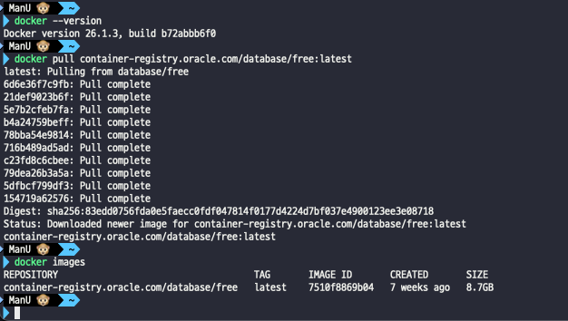

## 2일차

### 목차
1. Oracle 도커 설치
2. DB 설정

### **1. Oracle 도커 설치**
- Docker에서 oracle 이미지 컨테이너를 다운로드한 후 실행한다.
> **Docker설치시 오류 Docker desktop -> WSL Update failed**
>
  > - Docker Desktop 실행종료
  >
  > - 업데이트 실행 최신판 재부팅
- Oracle 최신판 설치
1. `docker --version`: Docker 버전 확인
2. `docker pull container-registry.oracle.com/database/free:latest`: Oracle 최신버전 다운로드
3. `docker images`: 다운받은 이미지 확인
4. `docker run -d -p 1521:1521 --name oracle container-registry.oracle.com/database/free`
   - 충돌 이슈로 `1152:1521` 사용 
5. `docker exec -it oracle bash`
   - `bash-4.4$ ./ setPassword.sh oracle`: 비밀번호 변경
6. DBeaver 탐색기 -> Create -> Connection



> MacOs는 Docker DeskTop 지원이 안되서 터미널로 방법을 교체했다...
>
> [MacOs DB설정](https://github.com/king-dong-gun/PKUN_DB/blob/master/md/day01.md)


### **2. DB 설정**
- `H2 DB`: Spring Boot에서 손쉽게 사용한 `Inmemory DB`, `Oracle`, `MySQL`, `SQLServer`와 쉽게 호환된다.
- `Oracle`: 운영시 사용할 DB
- `Oracle PKNUSB / pknu_P@ss`로 생성
- `sqlplis`: 접속 (Docker or Oracle) -> `System`으로 접속
  ```shell
  > sqlplus system/password
  SQL >
  ```
- `ALTER SESSION SET "_ORACLE_SCRIPT"=true;`: 서비스명 확인
- `create user pknusb identified by "pknu_p@ss";`: 사용자 생성
- `grant CONNECT, RESOURCE, CREATE SESSION, CREATE TABLE, CREATE SEQUENCE, CREATE VIEW to pknusb`: 사용자 권한 생성
- `alter user pknusb default tablespace users;`: 사용자 계정, 테이블 공간설정, 공간쿼터
- `alter user pknu quota unlimited on users;`

### **3. Spring Boot + MyBatis**
1. application name: spring02, jar, 17Ver
2. SpringBoot 3.2.6Ver, Spring Web
    - Spring Boot 3.3.x에는 MyBatis가 없다..!
3. `build.gradle`을 꼭 확인한다!!
4. `application.properties` 추가 작성한다.
   ```properties
    spring.application.name=spring02

    ## 포트 변경
    server.port=8091

    ## 로그 색상
    spring.output.ansi.enabled=always

    ## 수정사항이 있으면 서버 자동 재빌드 설정
    spring.devtools.livereload.enabled=true
    spring.devtools.restart.enabled=true

    ## 로그레벨 설정
    logging.level.org.springframework=info
    logging.level.org.zerock=debug

    ## 오라클 설정
    spring.datasource.username=pknusb
    spring.datasource.password=pknu_p@ss
    ## spiring.datasoure.url=jdbc:oracle:thin@localhost:11521:FREE
    spring.datasource.url=jdbc:oracle:thin@localhost:1521:FREE
    spring.datasource.driver-class-name=oracle.jdbc.OracleDriver

    ## MyBatis 설정
    ## mapper폴더 밑에 여러가지 폴더가 내재, 확장자는 .xml이지만 파일명은 상관없다!
    mybatis.mapper-locations=classpath:mapper/**/.xml
    mybatis.type-aliases-package=com.come1997.spring02.domain
   ```
5. main/java/com/username/spring02 경로에 `config`, `controller`, `domain`, `mapper` 파일 생성
    - `config`: 애플리케이션 설정 파일, Spring Boot, Java 설정 파일
    - `doamian`: 도메인을 만들 파일
    - `mapper`: 데이터베이스 매핑 관련 파일
    - `controller`: MVC 패턴에서 컨트롤러 클래스, 요청을 처리하고 응답을 생성한다.
> MyBatis 적용을 위해 Spring때 resource/WEB-INF 위치에 root-context.xml에 DB, MyBatis를 설정해야 했다. 
>
> **하지만 Spring Boot 이후 application.properties + Config.java로 변경되었다.**
6. 매핑할 xml 파일생성
**TodoMapper.java**
```java
package com.come1997.spring02.mapper;

import java.util.List;

import org.apache.ibatis.annotations.Mapper;

import com.come1997.spring02.domain.Todo;

@Mapper
public interface TodoMapper {
    List<Todo> selectTodos();

    Todo selectTodo(int tno);
}

```