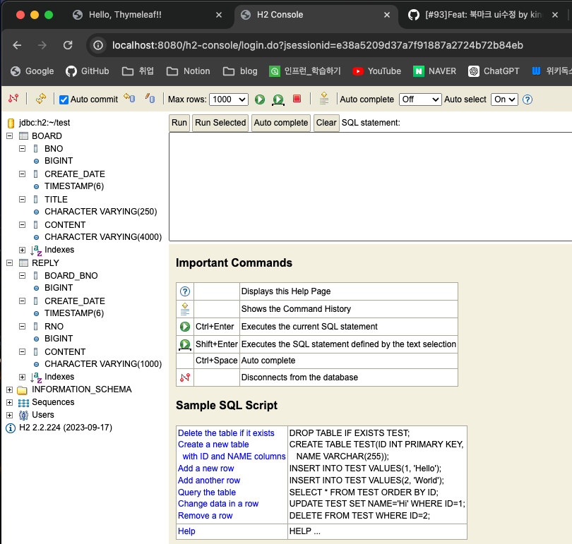

## 4일차

### 목차
1. `Spring Boot` + `JPA` + `Oracle` + `Thymeleaf`
2. JSP 프로젝트 생성
3. 개발시작


### **1. `Spring Boot` + `JPA` + `Oracle` + `Thymeleaf`**
1. `JAP`: DB 설계를 하지않고 엔티티 클래스를  DB로 자동생성 해주는 기술, Query를 만들 필요 없음!
2. `H2`: `Oracle`, `MySQL`, `SQLServer`등과 달리 `Inmemory DB`, `Spring Boot`가 실행되면 같이 실행되는데 `DB` 
3. `Thymeleaf`: `JSP`의 단점 복잡한 탬플릿 형태 + 스파게티 코드를 해소 해주는 탬플릿
4. `Bootstrap`: 웹 디자인 및 `CSS`의 혁신! + 커스터마이징도 가능하다.
5. 소셜 로그인: 구글, 카카오, 네이버 등등 소셜 로그인 기능
6. `React`: 프론트엔드를 분리, 백엔드 서버와 프론트엔드 서버를 따로 관리한다.

> `Spring Boot`, `JPA`용 프로젝트 새로 생성

### **2. JSP 프로젝트 생성**
1. `명령 팔레트 시작`: Spring Inititalzr: Create a Gradle projects...
2. `Spring Boot Version`: 3.2.6
3. `project language`: Java
4. `Group Id`: com.com1997
5. `Arifact Id`: backboard
6. `package type`: Jar
7. `Java version`: 17
8. `Dependency`:
   - `Spring Boot DevTools` 
   - `Lombok`
   - `Spring Web`
   - `Thymeleaf`
   - `Oracle Driver` (나중에 추가)
   - `H2 Database` (나중에 추가) 
   - `Data Jpa` (나중에 추가)
9. `Generate into this folder`: 새로 만든 `spring03` 폴더 안에!

### **3. 개발시작**
1. `build.gradle` 의존성 검사
2. `application.properties` 기본설정 입력
   - 포트번호
   - 로그색상
   - 자동 재빌드
   - 로그레벨
3. 각 기능별로 폴더를 생성(`controller`, `service`, `entitiy`...)
   - `controller` -> `MainController.java` 생성, 기본 메서드 구현
  
   **MainController.java**
   ```java
   package com.come1997.backboard.controller;

   import org.springframework.stereotype.Controller;

   import lombok.extern.log4j.Log4j2;
   import org.springframework.web.bind.annotation.GetMapping;
   import org.springframework.web.bind.annotation.RequestParam;
   import org.springframework.web.bind.annotation.ResponseBody;

   @Controller
   @Log4j2
   public class MainController {
      // 엔드포인트(매핑) /hello 설정
      @GetMapping("/hello")
      @ResponseBody
      public String getHello() {
         log.info("getHello(); 실행");
         // 문자열을 HTTP 응답문으로 반환
         return "Hello, SpringBoot03";
      }

   }

   ```

   

4. `hello.html` 파일 생성
   **MainController.java**
   ```java
   package com.come1997.backboard.controller;

   import org.springframework.stereotype.Controller;

   import lombok.extern.log4j.Log4j2;
   import org.springframework.web.bind.annotation.GetMapping;
   import org.springframework.web.bind.annotation.RequestParam;
   import org.springframework.web.bind.annotation.ResponseBody;

   @Controller
   // ResponseBody 삭제
   @Log4j2
   public class MainController {
      @GetMapping("/hello")
      public String getHello() {
         log.info("getHello(); 실행");
         // hello.html로 랜더링
         return "Hello";
      }

   }

   ```
   **hello.html**
   ```html
   <!DOCTYPE html>
   <html lang="en">
   <head>
      <meta charset="UTF-8">
      <meta name="viewport" content="width=device-width, initial-scale=1.0">
      <title>Hello, Thymeleaf!!</title>
   </head>
   <body>
      <h1>Hello, Thymeleaf!!</h1>
   </body>
   </html>

   ```
   

> ### Database 관리 정책
>
> `create`: 앱 실행시마다 새로 생성, 최초 개발시
>
> `create-drop`: 앱 실행시 생성, 종료시 드랍, **사용 비추천**
>
> `update`: 최초 한번만, 변경사항이 있으면 반영, 계속 개발시
>
> `validate`: DB 테이블과 엔티티 클래스가 일치하는지 검증만, 운영시
>
> `none(default)`: **사용 비추천**

5. `application.properties`: `H2`, `JPA` 설정 추가
6. 웹 서버 실행 `localhost:8080/h2-console` DB 연결 확인


7. `/entity/Board.java`, `/entity/Reply.java` 생성
- `GenerationType`타입
  - `AUTO`: `Spring Boot`에서 자동으로 선택(X)
  - `IDENTITY`: `MySQL`, `SQLServer`
  - `SEQUENCE`: `Oracle`(!)
    - *`column`이름을 `createData`로 만들면 DB에 컬럼명이 `create_date`로 생성된다.*
    - 컬럼명에 _(언더바)를 안 넣으려면
> ERD로 DB 설계를 하지 않고 엔티티클래스로 관계를 형성하려면 반드시 사용한다 -> `@ManyToOne`

8. 두 엔티티간 `@OneToMany`, `ManyToOne` 설정
9. 웹 서버 재시작 후 `h2-console`에서 테이블 생성 확인



10. `/repository/BoardRepository.java` 빈 인터페이스 (JpaReposity 상송) 생성
11. `/repository/ReplyRepository.java` 빈 인터페이스 (JpaReposity 상송) 생성
12. `application.properties` -> `spring.jpa.hibernate.ddl-auto=update`로 변경
13. `test/.../repository/BoardRepository` 생성 및 테스트 메서드 작성
14. 테스트 시작 -> 웹 서버 실행 -> h2-console 확인


