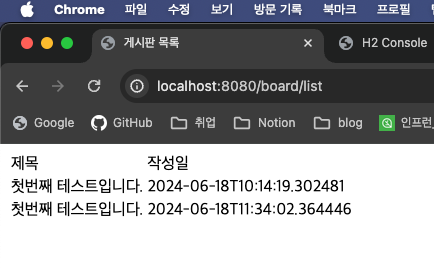
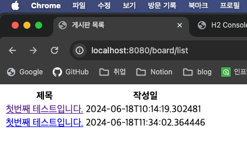
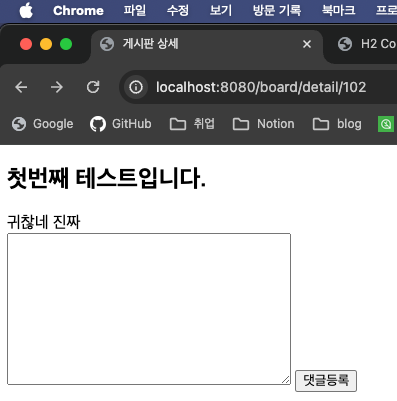
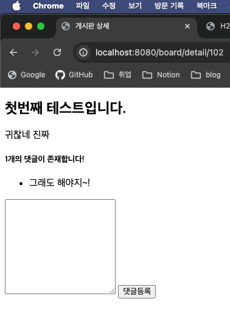
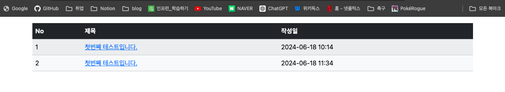
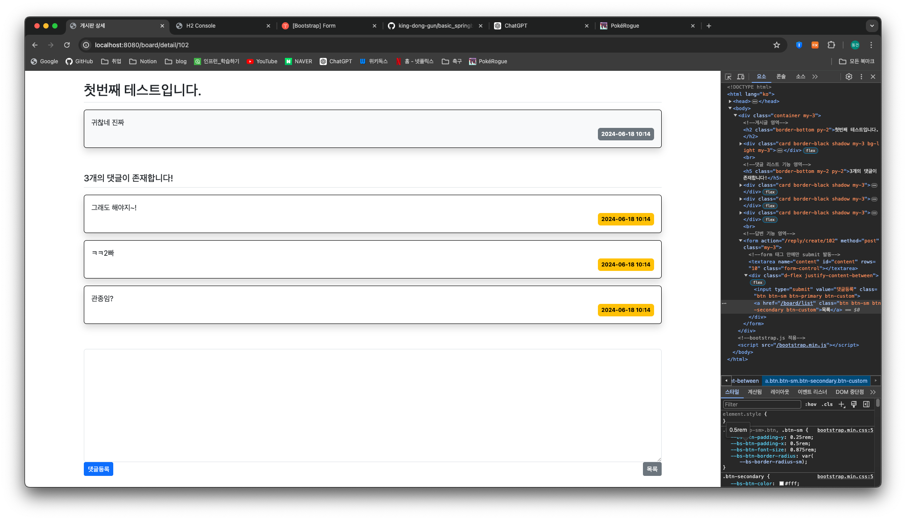

## 5일차

### 목차

1. Spring Boot JPA 프로젝트 개발 (~day04)
   - CRUD 확인
   - Service 코드 작성
   - Controller 코드 작성
   - Html 코드 작성 및 타임리프 적용


> #### 주의
> **파일 오픈시엔 꼭!! `.gradle`이 있는 폴더를 열어서 작업!!!**
> 
> **여러번 빌드시에 제대로 결과가 반영이 안될때**
> 
> 1. Github Remote Repository에 모두 커밋, 푸시한다.
> 
> 2. Local Repository 모두 삭제 후 새로 커밋한다.
> 
> 3. 프로젝트를 새로 로드하고, 초기화하면 빌드가 잘된다!!


### **1. Spring Boot JPA 프로젝트 개발 (~day04)**

> `Java Test 중 Open Jdk64-Bit Server VMWarning: Sharing is...`가 뜨면
> 
> 

1. `jUnit` 테스트로 CRUD 확인
2. `/service/BoardService.java` 생성 후 `getList()` 메서드 작성
```java
package com.come1997.backboard.service;


import com.come1997.backboard.entity.Board;
import com.come1997.backboard.repository.BoardRepository;
import lombok.RequiredArgsConstructor;
import org.springframework.stereotype.Service;

import java.util.List;

@Service
@RequiredArgsConstructor
public class BoardService {
    private final BoardRepository boardRepository;

    public List<Board> getList() {
        return boardRepository.findAll();
    }
}

```
> ### 흐름 및 역할
> - 데이터베이스에서 데이터를 조회하고, 필요한 로직을 적용한 후 컨트롤러에 전달한다.
> - 컨트롤러에서 요청을 받아 데이터를 처리한 후 다시 컨트롤러에 반환한다.
3. `/controller/BoardController.java` 생성 후 `/board/list`를 실행할 수 있는 메서드 작성

```java
    package com.come1997.backboard.controller;
    
    import com.come1997.backboard.entity.Board;
    import com.come1997.backboard.service.BoardService;
    import lombok.RequiredArgsConstructor;
    import org.springframework.stereotype.Controller;
    import org.springframework.ui.Model;
    import org.springframework.web.bind.annotation.GetMapping;
    import org.springframework.web.bind.annotation.RequestMapping;
    import org.springframework.web.bind.annotation.RequestMethod;
    import org.springframework.web.bind.annotation.RequestParam;
    
    import java.util.List;
    
    @RequiredArgsConstructor
    @RequestMapping("/board")   // Restful URL은 /board로 시작
    @Controller
    // @RequiredArgsConstructor
    public class BoardController {
    
        private final BoardService boardService;
    
        // @RequestMapping(value = "/list", method = RequestMethod.GET) -> 아래와 동일 기능
        @GetMapping("/list")
        public String requestMethodName(Model model) {  // Model: controller에 있는 객체를 view로 보내주는 역할을 하는 객체
            List<Board>boardList = this.boardService.getList();
            model.addAttribute("boardList", boardList); // thymeleaf, mustache, jsp등을 view로 보내는 기능!
            return "board/list";    // templates/board/list.html을 랜더링해서 리턴해라!
        }
    }

```
> ### 흐름 및 역할
> - 사용자 요청을 처리하고, 요청에 따라 서비스를 호출하여 필요한 데이터를 가져와 뷰에 전달한다.
> - 웹 요청을 받아 서비스를 호출하고, 그 결과를 뷰에 전달하여 사용자가 볼 수 있도록 한다.

4. `templates/board/list.html`에 타임리프를 적용해 웹 폼을 작성한다.
- 게시판 목록
```html
<!DOCTYPE html>
<html lang="ko" xmlns:th="http://www.thymeleaf.org">
<head>
  <meta charset="UTF-8">
  <title>게시판 목록</title>
</head>
<body>
<table>
  <thead>
  <tr>
    <td>제목</td>
    <td>작성일</td>
  </tr>
  </thead>
  <tbody>
  <tr th:each="board : ${boardList}">
    <td th:text="${board.title}"></td>
    <td th:text="${board.createDate}"></td>
  </tr>
  </tbody>
</table>
</body>
</html>


```
> ### 흐름 및 역할
> - 사용자에게 표시될 화면을 구성하고 Thymeleaf와 같은 템플릿 엔진을 사용하여 동적인 HTML을 생성한다.
> - 컨트롤러에서 전달된 데이터를 사용하여 HTML 페이지를 렌더링하고 사용자에게 표시한다.

#### 실행화면


5. `templates/board/detail.html`에 타임리프를 적용해 웹 폼을 작성한다.
- 게시판 상세
```html
<!DOCTYPE html>
<html lang="ko" xmlns:th="http://www.thymeleaf.org">
<head>
  <meta charset="UTF-8">
  <title>게시판 상세</title>
</head>
<body>
<h2 th:text="${board.title}"></h2>
<div th:text="${board.content}"></div>
<!--reply 기능 영역-->
<!--form 태그 안에만 submit 발동-->
<form th:action="@{|/reply/create/{bno}(bno=${board.bno})}" method="post">
  <textarea name="content" id="content" rows="10"></textarea>
  <input type="submit" value="댓글등록">
</form>
</body>
</html>


```

#### 실행화면
 

6. `/service/ReplyService.java`생성 후 댓글 저장 메서드를 작성한다.
```java
package com.come1997.backboard.service;


import com.come1997.backboard.entity.Board;
import com.come1997.backboard.entity.Reply;
import com.come1997.backboard.repository.ReplyRepository;
import lombok.RequiredArgsConstructor;
import org.slf4j.Logger;
import org.springframework.stereotype.Service;

import java.time.LocalDateTime;

@RequiredArgsConstructor
@Service
public class ReplyService {
    private final ReplyRepository replyRepository;
    private Logger log;

    // 메서드 작성
    // 댓글 작성 기능
    public void setReply(Board board, String content) {
        // 빌더를 사용하는 방식
        Reply reply = Reply.builder().content(content).createDate(LocalDateTime.now()).board(board).build();
        log.info("댓글 객체 생성완료!");
        this.replyRepository.save(reply);
        log.info("댓글 객체 저장성공!");

    }
}

```
7. `/controller/ReplyController.java`생성 후 `reply/create/{bno}` 포스트매핑 메서드를 작성한다.
```java
package com.come1997.backboard.controller;

import com.come1997.backboard.entity.Board;
import com.come1997.backboard.service.BoardService;
import com.come1997.backboard.service.ReplyService;
import lombok.RequiredArgsConstructor;
import lombok.extern.log4j.Log4j2;
import org.springframework.stereotype.Controller;
import org.springframework.ui.Model;
import org.springframework.web.bind.annotation.PathVariable;
import org.springframework.web.bind.annotation.PostMapping;
import org.springframework.web.bind.annotation.RequestMapping;
import org.springframework.web.bind.annotation.RequestParam;

@Log4j2
@Controller
@RequiredArgsConstructor
@RequestMapping("/reply")
public class ReplyController {

    private final ReplyService replyService;
    private final BoardService boardService;

    // 데이터를 서버로 전송하거나, 상태나 리소스를 변경할 때 post
    @PostMapping("/create/{bno}")
    public String create(Model model, @PathVariable("bno") Long bno, @RequestParam(value = "content") String content) throws Exception {
        Board board = this.boardService.getBoard(bno);
        this.replyService.setReply(board, content);
        log.info("ReplyController 댓글저장 완료!");
        return String.format("redirect:/board/detail/%s", bno);
    }
}

```
#### `detail.html` 수정
```html
<!DOCTYPE html>
<html lang="ko" xmlns:th="http://www.thymeleaf.org">
<head>
  <meta charset="UTF-8">
  <title>게시판 상세</title>
</head>
<body>
<!--게시글 영역-->
<h2 th:text="${board.title}"></h2>
<div th:text="${board.content}"></div>
<!--댓글 리스트 기능 영역-->
<h5 th:text="|${#lists.size(board.replyList)}개의 댓글이 존재합니다!|"></h5>
<div>
  <ul>
    <li th:each="reply : ${board.replyList}" th:text="${reply.content}"></li>
  </ul>
</div>
<!--답변 기능 영역-->
<form th:action="@{/reply/create/{bno}(bno=${board.bno})}" method="post"> <!--form 태그 안에만 submit 발동-->
  <textarea name="content" id="content" rows="10"></textarea>
  <input type="submit" value="댓글등록">
</form>
</body>
</html>

```



### **2. BootStrap 적용하기**
1. [부트스트랩 다운로드](https://getbootstrap.com/docs/5.3/getting-started/download/) 후 프로젝트에 위치시킨다.
2. CDM 링크를 추가한다.
   - `bootstrap.min.css`, `bootstrap.min.ks`를 `resource/static`에 위치 시킨다.
3. html에 적용시킨다.
```html
<!DOCTYPE html>
<html lang="ko" xmlns:th="http://www.thymeleaf.org">
<head>
  <meta charset="UTF-8">
  <title>게시판 목록</title>
  <meta name="viewport" content="width=device-width, initial-scale=1">
  <link rel="stylesheet" th:href="@{/bootstrap.min.css}">
</head>
<body>
<div class="container my-3">
  <table class="table table-light table-striped">
    <thead class="table-dark">
    <tr>
      <th>No</th>
      <th>제목</th>
      <th>작성일</th>
    </tr>
    </thead>
    <tbody>
    <tr th:each="board, loop : ${boardList}">
      <!--bootstrap 숫자 루프-->
      <td th:text="${loop.count}"></td>
      <td>
        <a th:href="@{/board/detail/{bno}(bno=${board.bno})}" th:text="${board.title}"></a>
      </td>
<!--      <td th:text="${board.content}"></td>-->
      <td th:text="${#temporals.format(board.createDate, 'yyyy-MM-dd HH:mm')}"></td>
    </tr>
    </tbody>
  </table>
</div>
<script th:src="@{/bootstrap.min.js}"></script>
</body>
</html>

```


```html
<!DOCTYPE html>
<html lang="ko" xmlns:th="http://www.thymeleaf.org">
<head>
  <meta charset="UTF-8">
  <title>게시판 상세</title>
  <meta name="viewport" content="width=device-width, initial-scale=1">
  <!--bootstrap.css 적용-->
  <link rel="stylesheet" th:href="@{/bootstrap.min.css}">
</head>
<body>
<div class="container my-3">

  <!--게시글 영역-->
  <h2 th:text="${board.title}" class="border-bottom py-2"></h2>
  <div class="card border-black shadow my-3 bg-light my-3">
    <div class="card-body">
      <div th:text="${board.content}" class="card-text"></div>
      <div class="d-flex justify-content-end">
        <div class="badge text-bg-secondary p-2">
          <div th:text="${#temporals.format(board.createDate, 'yyyy-MM-dd HH:mm')}"></div>
        </div>
      </div>
    </div>
  </div>
  <br>
  <!--댓글 리스트 기능 영역-->
  <h5 th:text="|${#lists.size(board.replyList)}개의 댓글이 존재합니다!|" class="border-bottom my-2 py-2"></h5>
  <div th:each="reply : ${board.replyList}" class="card border-black shadow my-3">
    <div class="card-body">
      <div th:text="${reply.content}" class="card-text"></div>
      <div class="d-flex justify-content-end">
        <div class="badge text-bg-warning p-2">
          <div th:text="${#temporals.format(board.createDate, 'yyyy-MM-dd HH:mm')}"></div>
        </div>
      </div>
    </div>
  </div>
  <br>
  <!--답변 기능 영역-->
  <form th:action="@{/reply/create/{bno}(bno=${board.bno})}" method="post" class="my-3"> <!--form 태그 안에만 submit 발동-->
    <textarea name="content" id="content" rows="10" class="form-control"></textarea>
    <div class="d-flex justify-content-between">
      <input type="submit" value="댓글등록" class="btn btn-sm btn-primary btn-custom">
      <a href="/board/list" class="btn btn-sm btn-secondary btn-custom">목록</a>
    </div>
  </form>
</div>
<!--bootstrap.js 적용-->
<script th:src="@{/bootstrap.min.js}"></script>
</body>
</html>

```




> css는 헤더에 위치해도 되지만 js는 바디가 끝나는 지점에 위치한다!!
> 
> 페이지 랜더링이 다 되지않아도 js가 실행되기 때문!!


