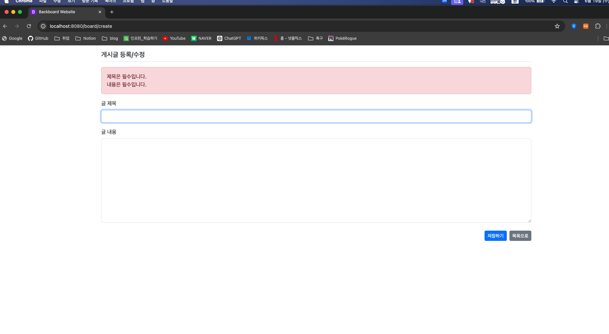

## 6일차

### 목차

1. Spring Boot JPA 프로젝트 개발
   - Thymeleaf, bootstrap으로 스타일링


### **1. Spring Boot JAP 프로젝트 개발**
1. `Thymeleaf`로 레이아웃 템플릿 생성
    - `/templates/layout.html` 파일 생성
    - `Thymeleaf` 적용을 위한 `build.gradle`에 디팬던시 추가
   ```java
      implementation 'nz.net.ultraq.thymeleaf:thymeleaf-layout-dialect'
   ```
   ```html
      <!DOCTYPE html>
   <html lang="ko" xmlns:th="http://www.thymeleaf.org">
   <head>
       <meta charset="UTF-8">
       <meta name="viewport" content="width=device-width, initial-scale=1">
       <title>Backboard Website</title>
       <!--<link rel="icon" type="image/x-icon" href="./assets/favicon.ico">-->
       <!--<link rel="stylesheet" type="text/css" th:href="@{/bootstrap.min.css}">-->
       <link href="https://cdn.jsdelivr.net/npm/bootstrap@5.3.3/dist/css/bootstrap.min.css" rel="stylesheet"
             integrity="sha384-QWTKZyjpPEjISv5WaRU9OFeRpok6YctnYmDr5pNlyT2bRjXh0JMhjY6hW+ALEwIH"
             crossorigin="anonymous">
       <!--웹사이트용 css-->
       <link rel="stylesheet" type="text/css" th:href="@{/main.css}">
       <!--favicon-->
       <link rel="icon" href="https://getbootstrap.com//docs/5.3/assets/img/favicons/favicon-32x32.png" sizes="32x32" type="image/png">
       <link rel="icon" href="https://getbootstrap.com//docs/5.3/assets/img/favicons/favicon-16x16.png" sizes="16x16" type="image/png">
   </head>
   <body>
   <!--레이아웃에 적용될 하위페이지 위치-->
   <th:block layout:fragment="main-content"></th:block>
   
   <!--각 페이지마다 추가되어야 할 JS 영역-->
   <!--<script th:src="@{/bootstrap.min.js}"></script>-->
   <script src="https://cdn.jsdelivr.net/npm/bootstrap@5.3.3/dist/js/bootstrap.bundle.min.js"
           integrity="sha384-YvpcrYf0tY3lHB60NNkmXc5s9fDVZLESaAA55NDzOxhy9GkcIdslK1eN7N6jIeHz"
           crossorigin="anonymous"></script>
   <th:block layout:fragment="script"></th:block>
   </body>
   </html>
   ```
2. `list.html`, `detail.html` 레이아웃 템플릿 적용
#### list.html
```html
      <!DOCTYPE html>
<html lang="ko" xmlns:th="http://www.Thymeleaf.org" layout:decorate="~{layout}">
<div layout:fragment="main-content" class="container my-3">
    <table class="table table-light table-striped">
        <thead class="table-dark">
        <tr>
            <th>번호</th>
            <th>제목</th>
            <th>작성일</th>
        </tr>
        </thead>
        <tbody>
        <tr th:each="board, loop : ${boardList}">
            <td th:text="${loop.count}"></td>
            <td>
                <a th:href="@{|/board/detail/${board.bno}|}" th:text="${board.title}"></a>
            </td>
            <td th:text="${#temporals.format(board.createDate, 'yyyy-MM-dd HH:mm')}"></td>
        </tr>
        </tbody>
    </table>
    <div class="d-flex justify-content-end">
        <a th:href="@{/board/create}" class="btn btn-sm btn-primary my-2">게시글 등록하기</a>
    </div>
</div>
</html>
```
#### detail.html
```html
<!DOCTYPE html>
<html lang="ko" xmlns:th="http://www.Thymeleaf.org" layout:decorate="~{layout}">

<div layout:fragment="main-content" class="container my-3">

    <!--게시글 영역-->
    <h2 th:text="${board.title}" class="border-bottom py-2"></h2>
    <div class="card border-black shadow my-3 bg-light my-3">
        <div class="card-body">
            <div th:text="${board.content}" class="card-text"></div>
            <div class="d-flex justify-content-end">
                <div class="badge text-bg-secondary p-2">
                    <div th:text="${#temporals.format(board.createDate, 'yyyy-MM-dd HH:mm')}"></div>
                </div>
            </div>
        </div>
    </div>
    <br>
    <!--댓글 리스트 기능 영역-->
    <h5 th:text="|${#lists.size(board.replyList)}개의 댓글이 존재합니다!|" class="border-bottom my-2 py-2"></h5>
    <div th:each="reply : ${board.replyList}" class="card border-black shadow my-3">
        <div class="card-body">
            <div th:text="${reply.content}" class="card-text"></div>
            <div class="d-flex justify-content-end">
                <div class="badge text-bg-warning p-2">
                    <div th:text="${#temporals.format(board.createDate, 'yyyy-MM-dd HH:mm')}"></div>
                </div>
            </div>
        </div>
    </div>
    <br>
    <!--답변 기능 영역-->
    <form th:action="@{/reply/create/{bno}(bno=${board.bno})}" method="post" class="my-3"> <!--form 태그 안에만 submit 발동-->
        <textarea name="content" id="content" rows="10" class="form-control"></textarea>
        <div class="d-flex justify-content-between my-3">
            <a href="/board/list" class="btn btn-sm btn-secondary btn-custom">목록</a>
            <input type="submit" value="댓글등록" class="btn btn-sm btn-primary btn-custom">
        </div>
    </form>
</div>
</html>

```


3. `templates/layout.html`의 `bootstrap` CDN을 적용
#### 아이콘 적용


4. `templates/board/create.html` 게시글 작성 페이지 생성
```html
<!DOCTYPE html>
<html lang="ko" xmlns:th="http://www.Thymeleaf.org" layout:decorate="~{layout}">
<div layout:fragment="main-content" class="container my-3">
    <h5 class="border-bottom my-3 pb-2">게시글 등록/수정</h5>

    <form th:action="@{/board/create}" method="post">
        <!--글 제목 영역-->
        <div class="mb-3">
            <label for="title" class="form-label">글 제목</label>
            <!--부트스틀랩 고정코드-->
            <input type="text" name="title" id="title" class="form-control">
        </div>
        <!--글 내용 영역-->
        <div class="mb-3">
            <label for="title" class="form-label">글 내용</label>
            <!--부트스틀랩 고정코드-->
            <textarea type="text" name="content" id="content" class="form-control" rows="10"></textarea>
        </div>
        <div class="d-flex justify-content-end">
            <input type="submit" value="저장하기" class="btn btn-sm btn-primary m-2">
            <a href="/board/list" class="btn btn-sm btn-secondary my-2">목록으로</a>
        </div>
    </form>
</div>
</html>
```


5. `/controller/BoardController.java`파일에 `create() GetMapping` 메서드 생성
#### controller.java
```java
    // 게시글 만들기
    @GetMapping("/create")
    public String create() {
        return "board/create";
    }

    // 만든 게시글 저장
    @PostMapping("/create")
    public String create(@RequestParam("title") String title, @RequestParam("content") String content) {
        this.boardService.setBoard(title, content);
        return "redirect:/board/list";
    }
```
#### service.java
```java
    // 작성한 게시글 저장
    public void setBoard(String title, String content) {
        // 빌더로 생성한 객체
        Board board = Board.builder().title(title).content(content).createDate(LocalDateTime.now()).build();

        this.boardRepository.save(board);
    }
```


#### 됐다!!


6. `/validation/BoardFrom.java` 파일 생성, `BorderController.java`메서드 생성으로 게시글 `Null`값 잡기
#### BoardForm.java
```java
package com.come1997.backboard.validation;

import jakarta.validation.constraints.NotBlank;
import lombok.Getter;
import lombok.Setter;

import jakarta.validation.constraints.NotEmpty;
import jakarta.validation.constraints.Size;

@Getter
@Setter
public class BoardForm {

    @Size(max = 250)
    // @NotEmpty(message = "제목은 필수입니다!")   // 스페이스를 허용한다.
    @NotBlank(message = "제목은 필수입니다!")
    private String title;

//    @NotEmpty(message = "내용은 필수입니다!")
    @NotBlank(message = "내용은 필수입니다!")
    private String content;
}

```
#### 
```java
    // 만든 게시글 저장
    @PostMapping("/create")
    public String create(@Valid BoardForm boardForm, BindingResult bindingResult) {
        if (bindingResult.hasErrors()) {
            return "board/create";  // 현재 html에 그대로 머무르기
        }

//        this.boardService.setBoard(title, content);
        this.boardService.setBoard(boardForm.getTitle(), boardForm.getContent());
        return "redirect:/board/list";
    }
```

 


7. `/validation/ReplyFrom.java` 파일 생성, `ReplyController.java`메서드 생성으로 게시글 `Null`값 잡기
#### BorderController.java
````java
    // 게시글 상세페이지
   // ReplyForm을 넘겨줘야함!
   @GetMapping("/detail/{bno}")
   public String detail(Model model, @PathVariable("bno") Long bno, ReplyForm replyForm) throws Exception {
      Board board = this.boardService.getBoard(bno);
      model.addAttribute("board", board);
      return "board/detail";
    }
````


#### ReplyForm.html
```java
    // 게시글 상세페이지
   // ReplyForm을 넘겨줘야함!
   @GetMapping("/detail/{bno}")
   public String detail(Model model, @PathVariable("bno") Long bno, ReplyForm replyForm) throws Exception {
      Board board = this.boardService.getBoard(bno);
      model.addAttribute("board", board);
      return "board/detail";
    }
```


8. `errors.html`파일로 묶어 간단하게 만든다.
#### errors.html
```html
<div th:fragment="formErrorFragment" class="alert alert-danger" role="alert" th:if="${#fields.hasAnyErrors()}">
    <div th:each="err : ${#fields.allErrors()}" th:text="${err}"></div>
</div>
```

#### create.html, detail.html
```html
<!--오류 메세지 영역-->
<div th:replace="~{errors :: formErrorFragment}"></div>
```


9. `layout.html`에 네비게이션 바 추가
10. `main.css`로 스타일링
11. 테스트로 대량 데이터 추가


> Trouble shooting
> 
> jakarta로 import를 해야하는데 중간에 javax랑 섞여있어서 build 오류가 났다.....
> 
> 전부 jakarta로 수정 후 재부팅하니 오류가 풀렸다.... 주의하자..!!!
