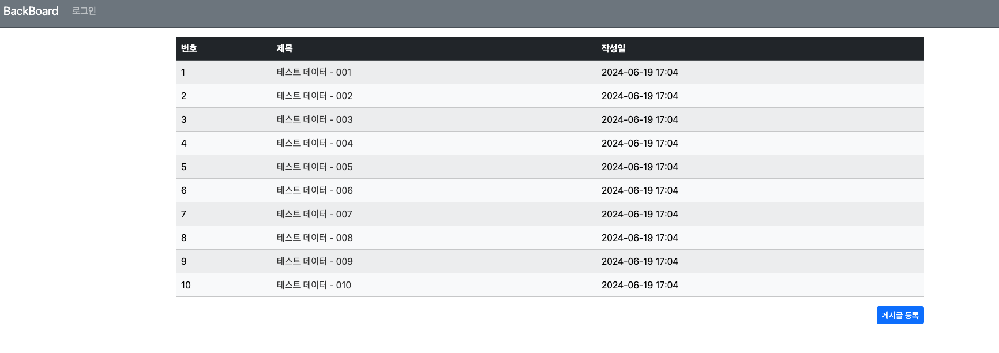

## 7일차

### 목차
1. Spring Boot JPA 프로젝트 개발
2. Spring Security
    - Spring Security란?
    - Spring Security 설정


### **1. Spring Boot JPA 프로젝트 개발**
1. `JpaRepository` 사용해서 페이징 10개로 줄이기
> `JpaRepository`: Spring Data JPA에서 제공하는 인터페이스 중 하나로, JPA를 사용하여 데이터베이스를 조작하기 위한 메서드들을 제공한다.
> - 복잡한 JDBC(Java DataBase Connectivity) 코드를 작성하지 않아도 간단하게 DB와의 데이터 접근 작업을 처리
#### 사용법
    
1. `JpaRepository` 인터페이스 상속받는 인터페이스 생성
```java
package com.come1997.backboard.repository;

import org.springframework.data.jpa.repository.JpaRepository;

import com.come1997.backboard.entity.Board;
import org.springframework.stereotype.Repository;

import java.util.List;
import java.util.Optional;  // Null값 체크해주는 기능

// 페이징을 위한 네임스페이스
import org.springframework.data.domain.Page;
import org.springframework.data.domain.Pageable;

// 인터페이스만 있어도 CRUD 가능
@Repository
public interface BoardRepository extends JpaRepository<Board, Long> {

    // 메서드명만 잘 만들면 쿼리를 생성하지 않고 JPA 만들어주는 기능 -> JpaRepository
    Optional<Board> findByBno(Long bno);
    Board findByTitle(String title);
    List<Board> findByTitleLike(String title);

    // 페이징용 JPA 쿼리 자동생성 인터페이스 메서드 작성
    @SuppressWarnings("null")   // 경고 메시지를 없애주는 어노테이션
    Page<Board> findAll(Pageable pageable);

}

```
2. `JPARepository method` 사용
#### BoardeService.java
````java
    // 페이징되는 리스트 메서드
    public Page<Board> getList(int page) {
        // 페이지 사이즈를 동적으로도 변경가능
        Pageable pageable = PageRequest.of(page, 10);
        return this.boardRepository.findAll(pageable);
    }
````

#### BoardController.java
```java
    @GetMapping("/list")
    // Model: controller에 있는 객체를 view로 보내주는 역할을 하는 객체
    public String requestMethodName(Model model, @RequestParam(value = "page", defaultValue = "0")int page) {
        Page<Board> paging = this.boardService.getList(page);   // 페이징된 Board를 view로 전달!!
        model.addAttribute("paging", paging);

        return "board/list";    // templates/board/list.html을 랜더링해서 리턴해라!
    }
```
3. html문 수정
#### list.html
```html
<!-- boardlist -> paging 으로 수정 -->
<tr th:each="board, loop : ${paging}">
            <td th:text="${loop.count}"></td>
            <td>
                <a th:href="@{|/board/detail/${board.bno}|}" th:text="${board.title}"></a>
            </td>
            <td th:text="${#temporals.format(board.createDate, 'yyyy-MM-dd HH:mm')}"></td>
        </tr>
```

#### 터미널에 생성된 JPA 자동 쿼리 완성
- 오라클 전용(11g 이하는 이 쿼리가 동작하지 않는다!)
- `from board b1_0 offset 0`: 0부터 시작해서 페이지 사이즈만큼 증가
- ``:


#### 페이징 10개로 수정확인


4. 페이지 버튼 추가하기
- 타임리프 페이지 버튼 코드
```html
    <!--페이징 시작-->
    <div th:if="${!paging.isEmpty()}">
        <ul class="pagination justify-content-center">
            <!--이전 버튼-->
            <li th:classappend="${!paging.hasPrevious()} ? disabled" class="page-item">
                <a th:href="@{|?page=${paging.number-1}|}" class="page-link">&lt;</a>
            </li>
            <!--페이지 번호-->
            <li th:each="page : ${#numbers.sequence(0, paging.totalPages-1)}"
                th:if="${page >= paging.number -2 and page <= paging.number +2}"
                th:classappend="${page == paging.number} ? 'active'" class="page-item">
                <a th:href="@{|?page=${page}|}" th:text="${page}" class="page-link">0</a>
            </li>
            <!--다음 버튼-->
            <li th:classappend="${!paging.hasNext()} ? disabled" class="page-item">
                <a th:href="@{|?page=${paging.number+1}|}" class="page-link">&gt;</a>
            </li>
        </ul>
    </div>
```
> `paging.isEmpty()`: 페이징 객체의 데이터가 있는 부분만 랜더링
> 
> `<li th:classappend="${!paging.hasPrevious()} ? 'disabled'" class="page-item">`: 이전 객체가 없는 경우 disabled
> 
> `<a th:href="@{|?page=${paging.number-1}|}" class="page-link">&lt;</a>`: 현재 페이지에서 -1을 뺀 페이지의 URL을 동적으로 생성
> 
> `<li th:classappend="${!paging.hasNext()} ? 'disabled'" class="page-item">`: 다음 객체가 없는 경우 disabled
> - `${paging.number-1}`를 사용하여 현재 페이지 번호에서 1을 뺀 값을 쿼리 파라미터로 전달
> 
> `th:each="page : ${#numbers.sequence(0, paging.totalPages-1)}"`: paging.totalPages - 1까지의 숫자 시퀀스를 생성
> 
> `th:if="${page >= paging.number -2 and page <= paging.number +2}"`: 조건을 만족하는 경우에만 페이징 랜더링, 앞,뒤 2개의 페이지만 보이기
> 
> `th:classappend="${page == paging.number} ? 'active'" class="page-item">`: 현재 반복 중인 페이지 번호와 현재 페이지 번호가 같으면 true를 반환 -> active 클래스를 추가
> 
>`<a th:href="@{|?page=${paging.number+1}|}" class="page-link">&gt;</a>`: 현재 페이지에서 +1을 더한 페이지 URL을 동적으로 생성
> - `${paging.number+1}`를 사용하여 현재 페이지 번호에서 1을 더한 값을 쿼리 파라미터로 전달


5. `BoardService.java` `getList()`에서 최신순, 역정렬로 변경하기
```java
    // createDate의 정렬기준을 desc(내림차순)으로!!
    public Page<Board> getList(int page) {
        List<Sort.Order> sort = new ArrayList<>();
        sort.add(Sort.Order.desc("createDate"));
        Pageable pageable = PageRequest.of(page, 10, Sort.by(sort));
        return this.boardRepository.findAll(pageable);
    }
```

6. `list.html`에 게시글 번호 수정

```html
<!--각 게시물의 번호를 역순으로!!-->
<td th:text="${paging.getTotalElements - (paging.number * paging.size) - loop.index}"></td>

```
7. 댓글 갯수 표시(뱃지 태그)
```html
<!--만약 replyList의 사이즈가 있다면 text로 css는 뱃지로 나타내라!!!-->
<span th:if="${#lists.size(board.replyList) > 0}" th:text="${#lists.size(board.replyList)}"
      class="badge text-bg-success"></span>
```

#### 게시글 최신순정렬, 게시물 번호 역순, 댓글 뱃지 태그 완료!!!


## **2. Spring Security**
### Spring Security란? 
- 스프링 부트는 회원가입과 로그인을 도와주는 스프링 시큐리티를 사용할 수 있다.
- 스프링 시큐리티는 **인증 (Authentication) ,권한(Authorize) 부여 및 보호 기능을 제공**하는 프레임워크이다.
### Spring Security 구조
#### 1. `SecurityContextHolder`, `SecurityContext`, `Authentication`
- 세가지 클래스는 스프링 시큐리티의 주요 컴포넌트
- `Authentication`: 실제 가입된 사용자인지 체크한 후 사용자의 정보를 가지고 있는 곳
- `SecurityContext`: 스프링 시큐리티에서 `Authentication`를 `SecurityContext`에 보관한다
- `SecurityContextHolder`: `SecurityContext`를 `SecurityContextHolder`에 담아 보관한다.


> 1. **Http Request 수신**
> - 사용자가 로그인 정보와 함께 인증 요청을 보낸다.
> 2. **유저 자격을 기반으로 인증토근 생성** 
> - `AuthenticationFilter`가 요청을 가로채고, 가로챈 정보를 통해
> `UsernamePasswordAuthenticationTocken`의 인증용 객체를 생성한다.
> 3. **Filter를 통해 AuthenticationTocken을 AuthenticationMnager로 위임**
> - `AuthenticationManager`의 구현체인 `ProviderManager`에게 생성한 UsernamePasswordToken 객체를 전달한다.
> 4. **AuthenticationProvider의 목록으로 인증을 시도**
> - `AutenticationManger`는 등록된 `AuthenticationProvider`들을 조회하며 인증을 요구한다.
> 5. **UserDetailsService의 요구**
> - 실제 DB에서 사용자 인증정보를 가져오는 `UserDetailsService`에 사용자 정보를 넘겨준다.
> 6. UserDetails를 이용해 User 객체에 대한 정보 탐색
> - 넘겨받은 사용자 정보를 통해 DB에서 찾아낸 사용자 정보인 `UserDetails` 객체를 만든다.
> 7. **User 객체의 정보들을 UserDetails가 UserDetailsService(LoginService)로 전달**
> - `AuthenticaitonProvider`들은 `UserDetails`를 넘겨받고 사용자 정보를 비교한다.
> 8. **인증 객체 or AuthenticationException**
> - 인증이 완료가 되면 권한 등의 사용자 정보를 담은 `Authentication` 객체를 반환한다.
> 9. **인증 끝**
> - 다시 최초의 `AuthenticationFilter`에 `Authentication`객체를 반환한다.
> 10. **SecurityContext에 인증 객체를 설정**
> - `Authentication`객체를 `Security Context`에 저장한다.
> 
-  최종적으로는 `SecurityContextHolder`는 세션 영역에 있는 `SecurityContext`에 `Authentication` 객체를 저장한다. 

- 사용자 정보를 저장한다는 것은 스프링 시큐리티가 전통적인 세선-쿠키 기반의 인증 방식을 사용한다는 것을 의미한다.

### 설정
1. `build.gradle`에 디펜던시 추가
```shell
// Spring Security 디팬던시
implementation 'org.springframework.boot:spring-boot-starter-security'
implementation 'org.thymeleaf.extras:thymeleaf-extras-springsecurity6'
```

2. `Gradle` 재빌드 후 서버 실행
3. 터미널에서 password 확인 **재실행마다 password가 변경된다!!**


4. 서버 접속

 

> localhost:8080으로 접속하면 로그인화면이 자동으로 뜬다!!
>
> - id: user
> - passowrd: 터미널에서 받은 값
> 
> 로그인을 하면 그 전에 만들었던 board가 나온다.

5. `/security/SecurityConfig.java` 보안설정 파일 생성 및 작성

#### SecurityConfig.java
```java
SecurityFilterChain securityFilterChain(HttpSecurity http) throws Exception {
    // http://localhost:8080에 로그인을 하지않고도 접근할 수 있는 권한을 주겠다!!```
    http.authorizeHttpRequests((atr) -> atr.requestMatchers(new AntPathRequestMatcher("/**")).permitAll())
```  
-  **`localhost:8080`으로 바로 접속하면 로그인 화면이 아닌 `board/list`로 바로 넘어가는 것을 볼 수 있다!!**

6. `application.poperties`설정
- H2 -> Oracle로 DB를 변경하기 위해서!!
```shell
## Oracle 설정 - 운영 DB
spring.datasource.url=jdbc:oracle:thin:@localhost:1521:XE
spring.datasource.driver-class-name=oracle.jdbc.OracleDriver
spring.datasource.username=pknusb
spring.datasource.password=pknu_p@ss
## JPA 설정
spring.jpa.properties.hibernate.dialect=org.hibernate.dialect.OracleDialect
```
- 재빌드 후 실행 되는지 확인

7. `BoardRepositoryTest`에서 DB 가져오기
```java
    @Test
    void testThreeHundredBoards() {
        for (int i = 0; i < 400; i++) {
            this.boardService.setBoard(String.format("테스트 데이터 - [%03d]", i + 1),
                    "별내용 없습니다.");
        }
    }
```

8. Oracle과 연동
> intelliJ 유료 버전이라 바로 연동이 가능하다...!!

 

9. `entity/Member.java` 작성
```java
package com.come1997.backboard.entity;


import jakarta.persistence.*;
import lombok.Builder;
import lombok.Data;

@Data
@Entity
@Builder
public class Member {

    @Id
    @GeneratedValue(strategy = GenerationType.SEQUENCE)
    private Long memberid;

    @Column(unique = true, length = 100)
    private String username;

    @Column(unique = true, length = 150)
    private String email;


    private String password;

}

```
#### 맴버 테이블이 생긴 것을 확인할 수 있다.
 

10. `MemberRepository.java` 생성
```java
package com.come1997.backboard.entity;


import jakarta.persistence.*;
import lombok.Builder;
import lombok.Data;

@Data
@Entity
@Builder
public class Member {

    @Id
    @GeneratedValue(strategy = GenerationType.SEQUENCE)
    private Long memberid;

    @Column(unique = true, length = 100)
    private String username;

    @Column(unique = true, length = 150)
    private String email;


    private String password;

}

```

11. `MemberService.java` 생성
- `setMember()` 메서드 작성
```java
package com.come1997.backboard.service;


import com.come1997.backboard.entity.Member;
import com.come1997.backboard.repository.MemberRepository;
import lombok.RequiredArgsConstructor;
import org.springframework.security.crypto.bcrypt.BCryptPasswordEncoder;
import org.springframework.stereotype.Service;

@Service
@RequiredArgsConstructor
public class MemberService {
    
    private final MemberRepository memberRepository;
    
    public Member setMember(String username, String email, String password) {
        // password는 암호화 때문에 포함하지 않는다
        Member member = Member.builder().username(username).email(email).build();
        
        BCryptPasswordEncoder encoder = new BCryptPasswordEncoder();
        // 암호화한 값을 DB에 저장
        member.setPassword(encoder.encode(password));
        this.memberRepository.save(member);
        
        return member;
    }
}

```


