## 8일차

### 목차
#### Spring Security JPA 개발 
1. 회원가입 추가
2. 로그인 추가
3. 게시글 작성자 추가

### **1. 로그인**
1. `/security/SecurityConfig.java`에 `BCryptPasswordEncoder`를 빈으로 작업한다.
```java
   package com.come1997.backboard.service;
   
   
   import com.come1997.backboard.entity.Member;
   import com.come1997.backboard.repository.MemberRepository;
   import lombok.RequiredArgsConstructor;
   import org.springframework.security.crypto.bcrypt.BCryptPasswordEncoder;
   import org.springframework.security.crypto.password.PasswordEncoder;
   import org.springframework.stereotype.Service;
   
   @Service
   @RequiredArgsConstructor
   public class MemberService {
   
       private final MemberRepository memberRepository;
       private final PasswordEncoder passwordEncoder;
   
       public Member setMember(String username, String email, String password) {
           // password는 암호화 때문에 포함하지 않는다
           Member member = Member.builder().username(username).email(email).build();
           // Bean을 등록해서 쓰는게 유지보수를 위해 더 좋다
           member.setPassword(passwordEncoder.encode(password));   // 암호화한 값을 DB에 저장
           this.memberRepository.save(member);
   
           return member;
       }
   }

```

2. `MemebrController` 수정, `Member` 작성
- 회원가입 로직을 만든다.
#### MemberController
````java
@PostMapping("/registar")
public String registar(@Valid MemberForm memberForm, BindingResult bindingResult) {
    if (bindingResult.hasErrors()) {
        return "member/registar";
    }
    if (!memberForm.getPassword1().equals(memberForm.getPassword2())) {
        bindingResult.rejectValue("password2", "passwordInCorrect", "비밀번호가 일치하지 않습니다!");
        return "member/registar";
    }
````
#### Member
````java
public class Member {

    @Id
    @GeneratedValue(strategy = GenerationType.SEQUENCE)
    private Long memberid;

    @Column(unique = true, length = 100)
    private String username;

    @Column(unique = true, length = 150)
    private String email;

    private String password;
````


3. `registar.html` 작성

#### registar.html
```html
<!DOCTYPE html>
<html lang="ko" xmlns:th="http://www.Thymeleaf.org" layout:decorate="~{layout}">
<div layout:fragment="main-content" class="card container my-3 form-registar">
    <div class="my-3 border-bottom">
        <h4>회원가입</h4>
    </div>
    <form th:action="@{/member/registar}" th:object="${memberForm}" method="post">
        <!--/templates/errors.html include-->
        <div th:replace="~{errors :: formErrorFragment}"></div>
        <div class="mb-3">
            <label for="username" class="form-label">이름</label>
            <input type="text" th:field="*{username}" class="form-control">
        </div>

        <div class="mb-3">
            <label for="email" class="form-label">이메일</label>
            <input type="email" th:field="*{email}" class="form-control">
        </div>

        <div class="mb-3">
            <label for="password1" class="form-label">비밀번호</label>
            <input type="password" th:field="*{password1}" class="form-control">
        </div>

        <div class="mb-3">
            <label for="password2" class="form-label">비밀번호 확인</label>
            <input type="password" th:field="*{password2}" class="form-control">
        </div>

        <div class="d-flex justify-content-center">
            <button type="submit" class="btn btn-sm btn-primary">회원가입</button>
            <a href="/" class="btn btn-sm btn-secondary">돌아가기</a>
        </div>
    </form>
</div>
</html>

```

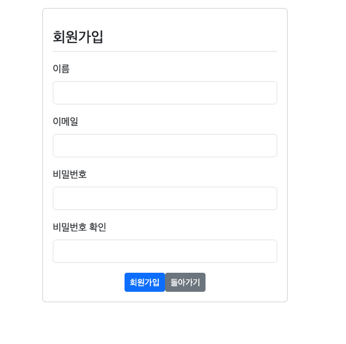

#### 회원가입 후 DB에 저장된 정보 확인

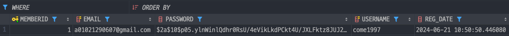

4. `layout.html` 회원가입 링크 추가
```html
<li class="nav-item">
    <a th:href="@{/member/registar}" class="nav-link">회원가입</a>
</li>
```

5. `MemberController`에 중복회원가입 방지 추가
```java
// 이미 가입된 회원 중복금지 처리
public class MemberController {

    private final MemberService memberService;

    // 회원가입
    @GetMapping("/registar")
    public String registar(MemberForm memberForm) {

        return "member/registar";   // member/registar로 랜더링
    }

    @PostMapping("/registar")
    public String registar(@Valid MemberForm memberForm, BindingResult bindingResult) {
        if (bindingResult.hasErrors()) {
            return "member/registar";
        }
        if (!memberForm.getPassword1().equals(memberForm.getPassword2())) {
            bindingResult.rejectValue("password2", "passwordInCorrect", "비밀번호가 일치하지 않습니다!");
            return "member/registar";
        }
        try {
            this.memberService.setMember(memberForm.getUsername(), memberForm.getEmail(), memberForm.getPassword1());
        } catch (DataIntegrityViolationException e) {
            e.printStackTrace();
            bindingResult.reject("registerFailed", "이미 가입된 회원입니다!");
            return "member/registar";
        } catch (Exception e) {
            e.printStackTrace();
            bindingResult.reject("registerFailed", e.getMessage());
            return "member/registar";
        }

        return "redirect:/";
    }
}
```
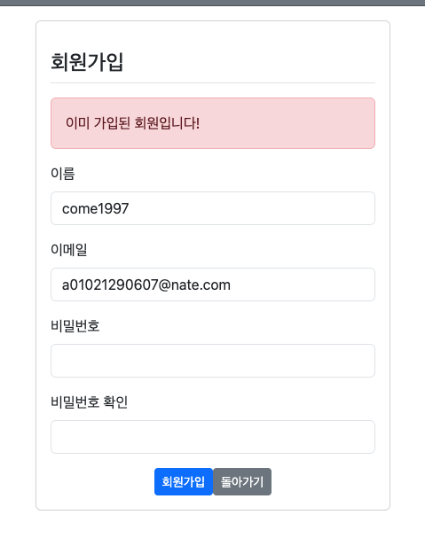

- 이메일이 달라도 이름이 같으면 회원가입 방지 및 이름이 다르고 이메일이 같아도 회원가입 방지된다!!!

6. `MemebrRole` 생성해 `ROLE_ADMIN`, `ROLE_USER` 생성
#### MemberRole
```java
package com.come1997.backboard.security;

import lombok.Getter;

@Getter
public enum MemberRole {
   // 회원 롤 생성
    ADMIN("ROLE_ADMIN"), USER("ROLE");

    MemberRole(String value) {
        this.value = value;
    }

    private String value;
}

```

7. `/entity/Member`에 `role` 저장


#### Member
```java
package com.come1997.backboard.entity;

public class Member {

    @Id
    @GeneratedValue(strategy = GenerationType.SEQUENCE)
    private Long memberid;

    @Column(unique = true, length = 100)
    private String username;

    @Column(unique = true, length = 150)
    private String email;

    private String password;

    @CreatedDate
    @Column(name = "regDate", updatable = false)
    private LocalDateTime regDate; // 회원가입일

    @Enumerated(EnumType.STRING)    // Enum 타입이 STRING "ROLE_ADMIN", "ROLE_USER"이기 때문에
    @Column(length = 15)
    private MemberRole memberRole;  // 맴버 역할

}

```
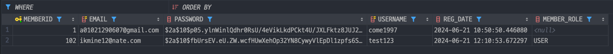

- DB에 `MEMBER_ROLE`이라는 컬럼이 생기고, `USER`인 일반 사용자로 확인이 되었다!!


### **2. 로그인 기능 추가**
1. `/security/SecurityConfig`에 로그인 url 설정
```java
SecurityFilterChain securityFilterChain(HttpSecurity http) throws Exception {
    // http://localhost:8080에 로그인을 하지않고도 접근할 수 있는 권한을 주겠다!!
    http.authorizeHttpRequests((atr) -> atr.requestMatchers(new AntPathRequestMatcher("/**"))
                    .permitAll())
            // CSRF 위변조 공격을 막는 부분 해제, 특정 URL은 csrf 공격 리스트에서 제거
            .csrf((csrf) -> csrf.ignoringRequestMatchers(new AntPathRequestMatcher("/h2-console/**")))
            // h2-console 페이지가 frameset, frame으로 구성 CORS와 유사한 옵션을 추가
            .headers((headers) -> headers
                    .addHeaderWriter((new XFrameOptionsHeaderWriter(
                            // ignoringRequestMatchers 영역에 있는 프레임을 해제
                            XFrameOptionsHeaderWriter.XFrameOptionsMode.SAMEORIGIN
                    ))))
            // 추가된 곳!!!
            
            // 로그인 관련된 url 지정 ~/member.login
            // 로그인이 성공하면 루트로 변경
            .formLogin((fl) -> fl.loginPage("/member/login").defaultSuccessUrl("/"))

    ;

    return http.build();
}
```

2. `layout.html` 로그인 링크 수정


3. `login.html`작성
#### login.html
```html
<!DOCTYPE html>
<html lang="ko" xmlns:th="http://www.Thymeleaf.org" layout:decorate="~{layout}">
<div layout:fragment="main-content" class="card container my-3 form-registar">
    <div class="my-3 border-bottom">
        <h4>로그인</h4>
    </div>
    <form th:action="@{/member/login}" method="post">
        <div th:if="${param.error}">
            <div class="alert alert-danger">
                이메일이나 비밀번호가 다릅니다!
            </div>
        </div>
        <div class="mb-3">
            <label for="username" class="form-label">이메일</label>
            <input type="text" name="username" id="username" class="form-control">
        </div>

        <div class="mb-3">
            <label for="password" class="form-label">비밀번호</label>
            <input type="password" name="password" id="password" class="form-control">
        </div>

        <div class="d-flex justify-content-center">
            <button type="submit" class="btn btn-sm btn-primary">로그인</button>
            <a href="/" class="btn btn-sm btn-secondary">돌아가기</a>
        </div>
    </form>
</div>
</html>

```

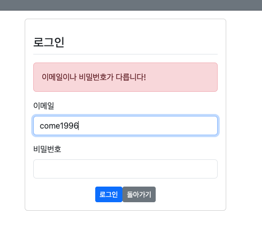

- 아이디나 비밀번호가 다르면 오류창도 잘뜨고 로그인 페이지가 만들어진 것을 확인할 수 있다.

4. `/repository/MemberRepository`에 `find*` 메서드 추가
```java
package com.come1997.backboard.repository;

import com.come1997.backboard.entity.Member;
import org.springframework.data.jpa.repository.JpaRepository;
import org.springframework.stereotype.Repository;

import java.util.Optional;

@Repository
public interface MemberRepository extends JpaRepository<Member, Long> {

    Optional<Member> findByUsername(String username);
    Optional<Member> findByEmail(String email);

}

```
5. `controller/MemberController`에 login `Get` 메서드 작성
```java
public class MemberController {

    private final MemberService memberService;

    // 로그인
    @GetMapping("/login")
    public String login() {
        return "member/login";
    }
}
```
6. `MemeberSecurityService`
   - 로그인은 `post`를 사용하지 않고, `Spring Security`가 지원하는 `UserDetailService`인터페이스 활용
```java
package com.come1997.backboard.service;

import com.come1997.backboard.entity.Member;
import com.come1997.backboard.repository.MemberRepository;
import com.come1997.backboard.security.MemberRole;
import lombok.RequiredArgsConstructor;
import org.springframework.security.core.GrantedAuthority;
import org.springframework.security.core.authority.SimpleGrantedAuthority;
import org.springframework.security.core.userdetails.User;
import org.springframework.security.core.userdetails.UserDetails;
import org.springframework.security.core.userdetails.UserDetailsService;
import org.springframework.security.core.userdetails.UsernameNotFoundException;
import org.springframework.stereotype.Service;

import java.util.ArrayList;
import java.util.List;
import java.util.Optional;

@RequiredArgsConstructor
@Service
public class MemberSecurityService implements UserDetailsService {
    private final MemberRepository memberRepository;

    @Override
    public UserDetails loadUserByUsername(String username) throws UsernameNotFoundException {
        Optional<Member> _member = this.memberRepository.findByUsername(username);
        if (_member.isEmpty()) {
            throw new UsernameNotFoundException("입력하신 회원을 찾을수 없습니다!");
        }
        Member member = _member.get();
        List<GrantedAuthority> grantedAuthorities = new ArrayList<>();
        if("admin".equals(username)) {
            grantedAuthorities.add(new SimpleGrantedAuthority(MemberRole.ADMIN.getValue()));
        } else {
            grantedAuthorities.add(new SimpleGrantedAuthority(MemberRole.USER.getValue()));
        }
        return new User(member.getUsername(), member.getPassword(), grantedAuthorities);
    }
}

```
7. `SecurityConfig` 계정관리자 빈 추가
```java
@Bean
    AuthenticationManager authenticationManager(AuthenticationConfiguration authenticationConfiguration) throws Exception {
        return authenticationConfiguration.getAuthenticationManager();
    }

    @Bean
    PasswordEncoder passwordEncoder() {
        return new BCryptPasswordEncoder(); // 암호화 빈으로 생성
    }
```

8. `layout.html` 로그인/회원가입 토글 추가
```html

<li class="nav-item">
   <!-- 로그인 안했을때 표시되는 부분 -->
   <a th:href="@{/member/login}" sec:authorize="isAnonymous()" class="nav-link">로그인</a>

   <!-- 로그인 된 이후 표시되는 부분 -->
   <a th:href="@{/member/logout}" sec:authorize="isAuthenticated()" class="nav-link">로그아웃</a>

</li>
```

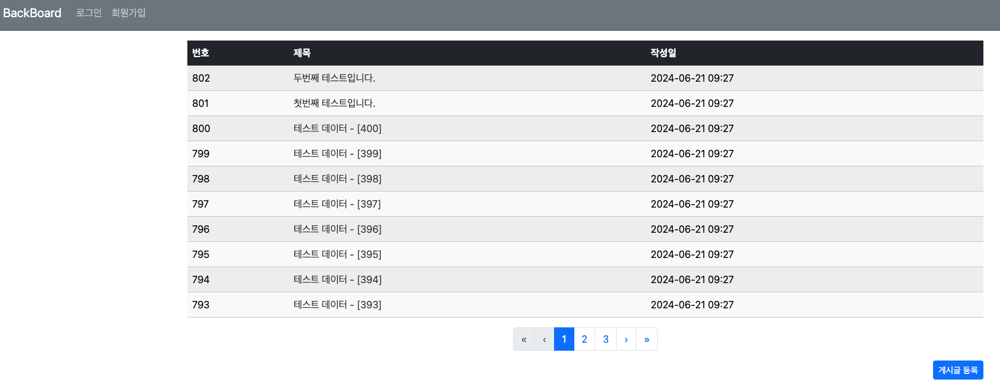

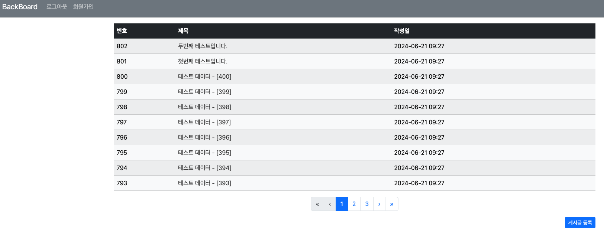

네비게이션바의 로그인 유무에 따라 **로그인, 로그아웃**으로 바뀐 것을 볼 수있다. 

>> 시큐리티 끝!!!!


## **3. 게시글 작성자 추가**
1. `Reply.java`에 작성자 변수(속성)추가
```java
    // 사용자가 여러개의 게시글을 작성할 수 있다, 다대일
    @ManyToOne
    private Member writer;
```
2. `MemberService`에 `getMember()` 메서드 추가
   - **`deault Exception`으로 예외를 처리하면 메서드 뒤에 항상 `throws Exception`을 적어줘야 한다!!**
   - `/common/NotFoundException.java`생성 -> `throw Exception`을 쓰는데 반영된다.
#### NotFoundException.java
```java
package com.come1997.backboard.common;

import org.springframework.http.HttpStatus;
import org.springframework.web.bind.annotation.ResponseStatus;

@ResponseStatus(value = HttpStatus.NOT_FOUND, reason = "entity not found...")   // 응답 처리 어노테이션
public class NotFoundException extends RuntimeException {

    private static final long serialVersionUID = 1L;

    public NotFoundException(String message) {
        super(message); // RuntimeException에서 처리한다.
    }
}

``` 
#### MemberService.java
````java
public Member getMember(String username) {
    Optional<Member> member = this.memberRepository.findByUsername(username);
    if (member.isPresent()) {
        return member.get();
    } else throw new NotFoundException("Member not found...");
}
````
> `throws Exception` 대신 `NotFoundException`을 사용해도 되는 것을 확인!! 

3. `ReplyService`에서 `setReply()`메서드에 작성자 추가
   ```java
    public void setReply(Board board, String content, Member writer) {
        // 빌더를 사용하는 방식
        Reply reply = Reply.builder().content(content).createDate(LocalDateTime.now()).board(board).build();
        reply.setWriter(writer);    // 작성자 추가
        this.replyRepository.save(reply);
   ```

4. `ReplyController`에서 `setReply` 파라미터 수정
   - 파라미터를 2개만 받다가 작성자가 추가되서 생기는 오류이므로 당연한거다!!

   ```java
   public String create(Model model, @PathVariable("bno") Long bno, @Valid ReplyForm replyForm, BindingResult bindingResult, Principal principal) throws Exception {
   
           Board board = this.boardService.getBoard(bno);
           Member writer = this.memberService.getMember(principal.getName());  // 현재 로그인중인 사용자의 id를 가져온다
   
           if(bindingResult.hasErrors()) {
               model.addAttribute("board", board);
               return "board/detail";
           }
           this.replyService.setReply(board, replyForm.getContent(), writer);
           log.info("ReplyController 댓글저장 완료!");
           return String.format("redirect:/board/detail/%s", bno);
       }
   ```

5. `BoardController`에 `setBoard()` 메서드에 사용자 파라미터 추가
- `get`, `post` 메서드에 `@PreAuthorzie` 어노테이션 추가
   ```java
   // 게시글 만들기
    @PreAuthorize("isAuthenticated()")
    @GetMapping("/create")
    public String create(BoardForm boardForm) {
        return "board/create";
    }

    // 만든 게시글 저장
    @PreAuthorize("isAuthenticated()")
    @PostMapping("/create")
    public String create(@Valid BoardForm boardForm, BindingResult bindingResult, Principal principal) {
        if (bindingResult.hasErrors()) {
            return "board/create";  // 현재 html에 그대로 머무르기
        }

        Member writer = this.memberService.getMember(principal.getName());
        this.boardService.setBoard(boardForm.getTitle(), boardForm.getContent(), writer);
        return "redirect:/board/list";
    }
   ```


6. `SecurityConfig`에 `@PreAuthorzie` 동작하도록 설정
> `@EnableMethodSecurity(prePostEnabled = true): @PreAuthorize 사용설정 어노테이션`

7. 로그인전, 로그인후의 `textarea` 설정
#### detail.html
```html
<textarea sec:authorize="isAnonymous()" disabled th:field="*{content}" rows="10"
          class="form-control"></textarea>
<textarea sec:authorize="isAuthenticated()" enabled th:field="*{content}" rows="10"
```
#### 로그인 전
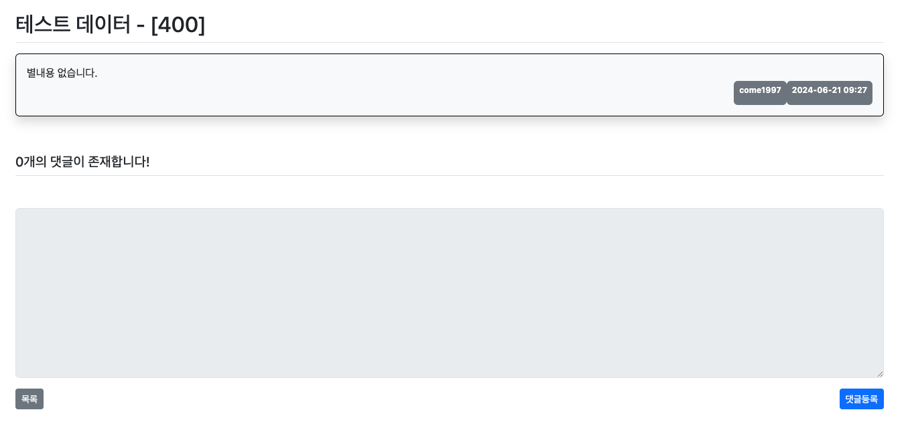

#### 로그인 후
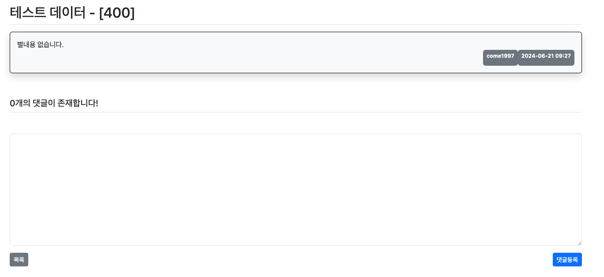


7. 작성자 칼럼 추가
- DB에 MEMBER_WRITER가 들어왔는지 확인한다.


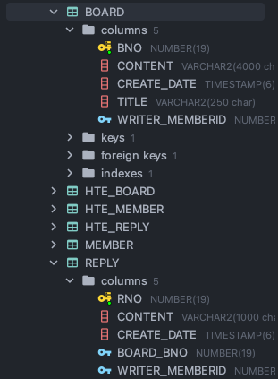

8. 게시글 작성자, 댓글 작성자 표시 추가
#### detail.html
```html
<!--작성자와 작성일을 표시하는 벳지-->
<div class="badge text-bg-secondary p-2">
   <div class="mb-2">
      <span th:if="${board.writer != null}" th:text="${board.writer.username}"></span>
   </div>
</div>
<!--생략-->
<div class="badge text-bg-secondary p-2">
   <div class="mb-2">
      <span th:if="${reply.writer != null}" th:text="${reply.writer.username}"></span>
   </div>
</div>


```

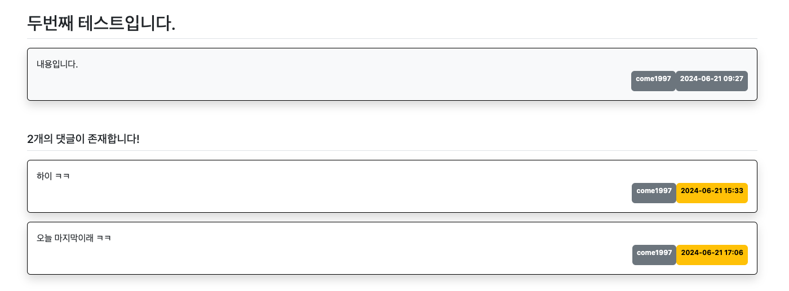


