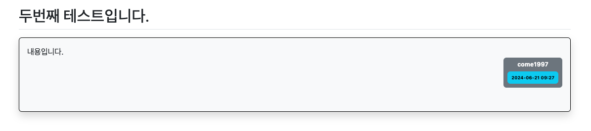
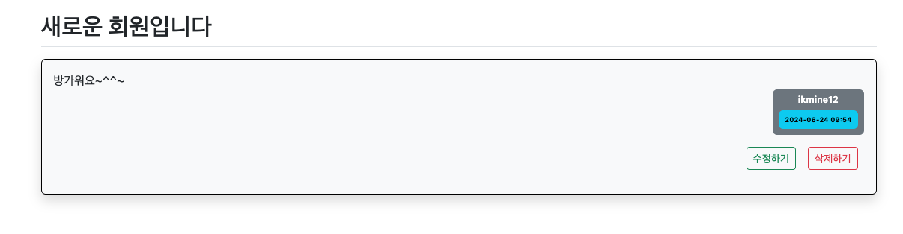
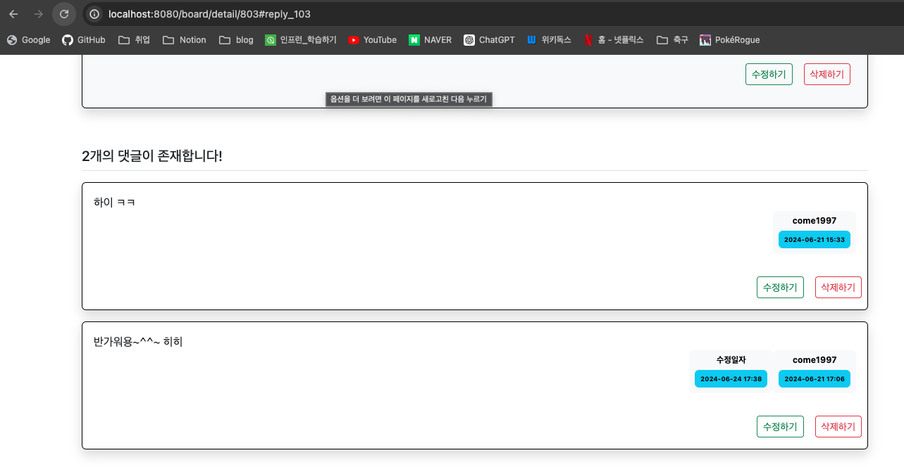

## 9일차

### 목차

#### Spring Boot JPA 개발
1. 기능 추가
   - 수정, 삭제 추가
   - 앵커 기능 추가
   - 마크다운 적용, 에디어 추가
   - 검색 기능 추가
   - 카테고리 추가(게시판, QnA, 공지사항)
   - 비밀번호 찾기 및 변경 추가
   - 조회수 추가
2. 리액트 적용


#### **1. 기능추가**
1. 게시글 수정하기
#### Board.java, Reply.java에 `modifyDate` 필드 추가
```java
    @LastModifiedDate
    @Column(name = "modifyDate")
    private LocalDateTime modifyDate;   // 24.06.24 수정일 추가
```
#### `detail.html`에 수정, 삭제 버튼 추가
```html
<!--수정 삭제 버튼 영역-->
<div class="d-flex justify-content-end">
    <div class="my-3 d-flex justify-content-end">
       <!--작성자와 게시한 유저의 이름이 같지 않다면 버튼 안보이게 하기-->
        <a th:href="@{|/board/modify/${board.bno}|}"
           th:if="${board.writer != null and #authentication.getPrincipal().getUsername() == board.writer.username}"
           sec:authorize="isAuthenticated()" class="btn btn-sm btn-outline-success mx-2">수정하기</a>
        <a th:href="@{|/board/modify/${board.bno}|}"
           th:if="${board.writer != null and #authentication.getPrincipal().getUsername() == board.writer.username}"
           sec:authorize="isAuthenticated()" class="btn btn-sm btn-outline-danger mx-2">삭제하기</a>
    </div>
</div>
```
#### 로그인한 유저의 게시글이 아닐때


#### 로그인한 유저의 게시글일때



> `sec:authorize="isAuthenticated()"`코드가 없으면 500에러가 난다..


#### `BoardController.java` 에 `GET` 메서드 작성
- `get`이 `/board/create`로 들어가면 `post`도 같은 URL로 실행되고 `/board/modi/{bno}`로 실행하면 `post도 같은 값을 보낸다. 
```java
@PreAuthorize("isAuthenticated()")
@GetMapping("/modify/{bno}")
public String modify(@PathVariable("bno") Long bno, BoardForm boardForm, Principal principal) {
   // 게시글을 데이터베이스에서 가져옴
   Board board = this.boardService.getBoard(bno);

   // 현재 로그인한 사용자와 게시글의 작성자가 일치하지 않으면 권한 없음 오류 반환
   if (!board.getWriter().getUsername().equals(principal.getName())) {
      throw new ResponseStatusException(HttpStatus.BAD_REQUEST, "수정권한이 없습니다 !");
   }

   // 수정 폼에 게시글의 제목과 내용을 설정
   boardForm.setTitle(board.getTitle());
   boardForm.setContent(board.getContent());

   // 수정 화면으로 이동
   return "board/create";
}

```
- `create.html`에 `th:action` 삭제


#### `BoardService.java` 수정 관련 메서드 추가 작성
- `BoardController`에 `modify` `post`메서드 작성
```java
@PreAuthorize("isAuthenticated()")
@PostMapping("/modify/{bno}")
public String modify(@Valid BoardForm boardForm, BindingResult bindingResult, Principal principal, @PathVariable("bno") Long bno) {
   // 유효성 검사에서 에러가 발생하면, 게시글 작성 페이지로 이동
   if (bindingResult.hasErrors()) {
      return "board/create";  // 현재 html에 그대로 머무르기
   }

   // 게시글을 데이터베이스에서 가져옴
   Board board = this.boardService.getBoard(bno);

   // 게시글 작성자와 현재 사용자가 일치하는지 확인
   if (!board.getWriter().getUsername().equals(principal.getName())) {
      throw new ResponseStatusException(HttpStatus.BAD_REQUEST, "수정권한이 없습니다 !");
   }

   // 게시글 수정
   this.boardService.modBoard(board, boardForm.getTitle(), boardForm.getContent());

   // 수정 완료 후 게시글 상세 페이지로 리디렉션
   return String.format("redirect:/board/detail/%s", bno);
}

```
#### 수정한 내용


2. 게시글, 댓글 삭제하기
#### `BoardService`에 삭제 관련 메서드 추가
```java
// 삭제 처리
public void remBoard(Board board) {
    this.boardRepository.delete(board);
}
```

#### 게시글 삭제
```java
@PreAuthorize("isAuthenticated()")
@GetMapping("/delete/{bno}")
public String delete(@PathVariable("bno") Long bno, Principal principal) {
    Board board = this.boardService.getBoard(bno);
    if (!board.getWriter().getUsername().equals(principal.getName())) {
        throw new ResponseStatusException(HttpStatus.BAD_REQUEST, "수정권한이 없습니다 !");
    }
```


#### 댓글 삭제 
```java
@PreAuthorize("isAuthenticated()")
@GetMapping("/delete/{rno}")
public String delete (@PathVariable("rno") Long rno, Principal principal) {
    Reply reply = this.replyService.getReply(rno);
    if (!reply.getWriter().getUsername().equals(principal.getName())) {
        throw new ResponseStatusException(HttpStatus.BAD_REQUEST, "삭제권한이 없습니다 !");
    }
    this.replyService.remReply(reply);
    return String.format("redirect:/board/detail/%s", reply.getBoard().getBno());
}
```


#### `modify.html` 작성
```html
<html layout:decorate="~{layout}">
<div layout:fragment="main-content" class="container">
    <h5 class="my-3 border-bottom pb-2">댓글 수정</h5>
    <form th:object="${replyForm}" method="post">
        <input type="hidden" th:name="${_csrf.parameterName}" th:value="${_csrf.token}"/>
        <div th:replace="~{errors :: formErrorsFragment}"></div>
        <div class="mb-3">
            <label for="content" class="form-label">내용</label>
            <textarea th:field="*{content}" class="form-control" rows="10"></textarea>
        </div>
        <div class="d-flex justify-content-end">
        <input type="submit" value="저장하기" class="btn btn-primary my-2">
            <a href="/board/list" class="btn btn-sm btn-secondary my-2">취소하기</a>
        </div>
    </form>
</div>
</html>
```


3. 앵커기능
- 추가, 수정, 삭제 시 이전 자신의 위치로 되돌아가는 기능
#### 목록 되돌리기, 수정 댓글 위치로 
```html
<!--댓글 위치-->
<a th:id="|reply_${reply.rno}|"></a>
<!--생략....-->

<!--목록-->
<div class="d-flex justify-content-between my-3">
    <a th:href="${prevUrl}" class="btn btn-sm btn-secondary btn-custom">목록</a>
    <input type="submit" value="댓글등록" class="btn btn-sm btn-primary btn-custom">
</div>
```

#### `BoardController`에 `modify()`, `detail` 메서드 추가 및 수정
```java
@GetMapping("/detail/{bno}")
public String detail(Model model, @PathVariable("bno") Long bno, ReplyForm replyForm, HttpServletRequest request) {
    String prevUrl = request.getHeader("referer");  // 이전 페이지 변수에 담기
    log.info(String.format("➡️현재 이전 페이지 : %s", prevUrl));
    Board board = this.boardService.getBoard(bno);
    model.addAttribute("board", board);
    model.addAttribute("prevUrl", prevUrl); // 이전 페이지 URL 뷰에 전달
    return "board/detail";
}

/*생략*/

@PreAuthorize("isAuthenticated()")
@GetMapping("/modify/{bno}")
public String modify(@PathVariable("bno") Long bno, BoardForm boardForm, Principal principal) {
   Board board = this.boardService.getBoard(bno);

   // 현재 로그인한 사용자와 게시글의 작성자가 일치하지 않으면 권한 없음 오류 반환
   if (!board.getWriter().getUsername().equals(principal.getName())) {
      throw new ResponseStatusException(HttpStatus.BAD_REQUEST, "수정권한이 없습니다 !");
   }

   boardForm.setTitle(board.getTitle());
   boardForm.setContent(board.getContent());
   return "board/create";  // 수정 화면으로 이동
}

@PreAuthorize("isAuthenticated()")
@PostMapping("/modify/{bno}")
public String modify(@Valid BoardForm boardForm, BindingResult bindingResult, Principal principal, @PathVariable("bno") Long bno) {
   if (bindingResult.hasErrors()) {
      return "board/create";  // 현재 html에 그대로 머무르기
   }
   Board board = this.boardService.getBoard(bno);
   if (!board.getWriter().getUsername().equals(principal.getName())) {
      throw new ResponseStatusException(HttpStatus.BAD_REQUEST, "수정권한이 없습니다 !");
   }
   this.boardService.modBoard(board, boardForm.getTitle(), boardForm.getContent());
   return String.format("redirect:/board/detail/%s", bno);
}
```


#### `ReplyService`에 생성 메서드 `void` -> `Reply`로 수정
```java
    // 댓글을 수정하기 위한 댓글 가져오기
    public Reply getReply(Long rno) {   // void -> Reply 타입 변경
        Optional<Reply> reply = this.replyRepository.findById(rno);
        if (reply.isPresent())
            return reply.get();
        else
            throw new NotFoundException("Reply Not Found...!");
    }
```


#### 댓글이 수정되면 댓글마다 번호가 주어지며 수정된 댓글로 이동한다.


#### 댓글 상세 페이지에서 목록으로 넘어가면 1페이지가 아닌 그 전 페이지로 이동한다.


4. 검색 기능
#### `BoardService`에 `search()` 메서드 추가
```java

```

#### `BoardRepository`에 `findAll()` 메서드 추가
```java

```

#### `BoardService`에 `getList()` 메서드 추가


#### `BoardController`에 `getList()` 메서드 추가

#### `list.html` 검색창 추가, `searchForm` 영역 추가, 페이징 영역 수정, js 추가


5. 마크다운 적용
- 마크다운 뷰, 마크다운 에디터 추가


