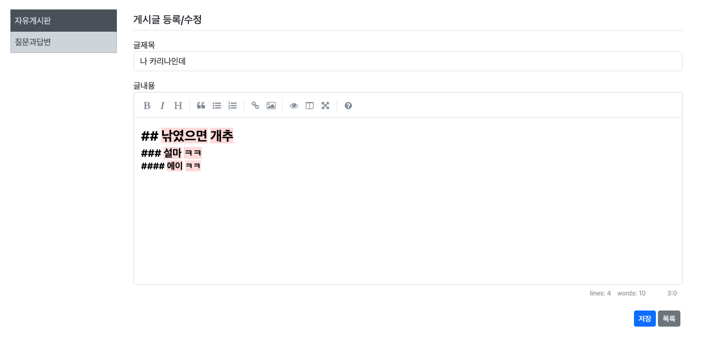
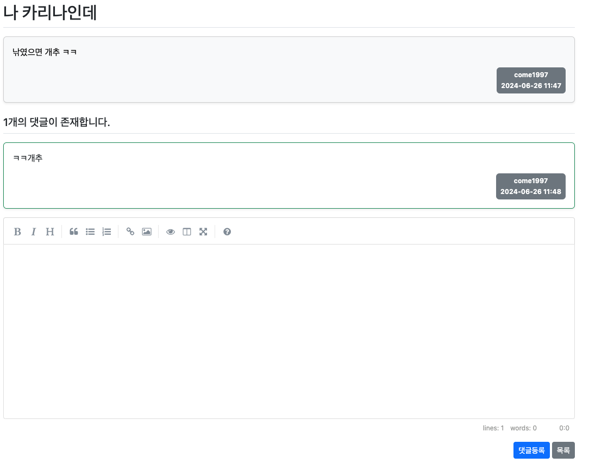
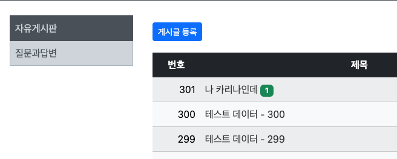
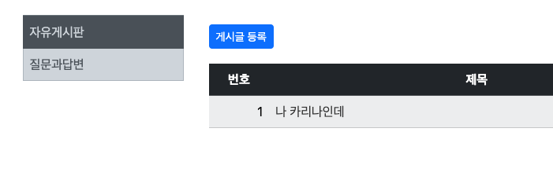
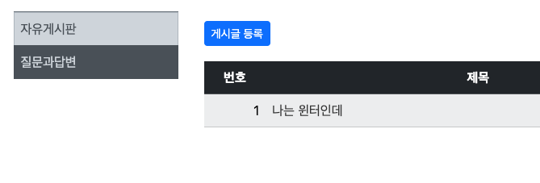

## 10일차

### 목차
#### Spring Boot JPA 프로젝트 개발 
1. 검색 기능: JPA Query
  - `@Query` 어노테이션으로 직접 작성
  - DB 표준쿼리와 차이가 있다(Java Entity와 일치)
2. 마크다운 적용
3. 카테고리 설정

### **1. 검색기능**
#### `BoardRepository`에 `findAllByKeyword()` 메서드 작성
- 단순 쿼리가 아니라 `JpaRepository`가 자동으로 만들어 줄 수 없을 때 사용
```java
// 제목 또는 내용으로 검색하는 키워드를 찾기위한 메서드 추가

// 중복된 게시글 제거
@Query("SELECT DISTINCT board " +
        "FROM Board board " +
        "LEFT JOIN Reply reply ON reply.board = board " +
        "WHERE board.title LIKE %:kw% " +
        "OR board.content LIKE %:kw% " +
        "OR reply.content LIKE %:kw%")
Page<Board> findAllByKeyword(@Param("kw") String keyword, Pageable pageable);
```


### **2. 마크다운 적용**
1. `Wysiwyg` 에디터 -> `CKEditor`, `TinyMCE` 사용
2. - [simplemde()](https://simplemde.com/)
- 깃헙에 CDN 링크복사 `layout.html`에 링크추가
- `create.html`에 `textarea` **id**값을 `content`를 `simplemde`로 변환하는 js추가
```html
<!-- SimpleMDE js CDN-->
<script src="https://cdn.jsdelivr.net/simplemde/latest/simplemde.min.js"></script>
<!-- 각 페이지마다 추가되어야 할 자바스크립트 영역 -->
<th:block layout:fragment="sub-script"></th:block>
</body>
</html>
```
3. `detail.html` `textarea` `content` 타임리프문 수정
```html
<!--textarea, content 수정 부분-->
<textarea sec:authorize="isAnonymous()" disabled th:field="*{content}" rows="10"
          class="form-control"></textarea>
<textarea sec:authorize="isAuthenticated()" enabled th:field="*{content}" rows="10"
          class="form-control"></textarea>
```
4. `build.gradle` 마크다운 디팬던시 추가
```shell
// 마크다운 뷰어 디펜던시
implementation 'org.commonmark:commonmark:0.22.0'
```
5. `Common/commonUtil.java`생성
```java
package com.come1997.backboard.common;

import org.springframework.stereotype.Component;

import org.commonmark.parser.Parser;
import org.commonmark.renderer.html.HtmlRenderer;
import org.commonmark.node.Node;

// 컴포넌트 어노테이션에 value값 주어져야 함
@Component("CommonUtil")
public class CommonUtil {
    public String markdown(String content) {
        Parser parser = Parser.builder().build();
        Node document = parser.parse(content);  // 기존 마크다운으로 작성된 툴 파싱
        HtmlRenderer renderer = HtmlRenderer.builder().build();

        return renderer.render(document);   // html로 렌더링 텍스트 리턴
    }
}

```
- `detail.html` 마크더운 뷰어 적용
```javascript
<script layout:fragment="sub-script" type="text/javascript">
    // 마크다운 에디터 추가
    var simplemde = new SimpleMDE({element: document.getElementById("content")})
    const del_elments = document.getElementsByClassName('delete');
</script>
```
#### 게시글 작성 마크다운


#### 댓글 마크다운


### **3. 카테고리 설정**
1. `Category.java` 클래스 추가
#### id, title, createDate 선언
```java
package com.come1997.backboard.entity;

@Getter
@Setter
@Entity
public class Category {
    @Id
    @GeneratedValue(strategy = GenerationType.SEQUENCE)
    private Integer id;

    @Column(length = 30)
    private String title;

    @CreatedDate
    @Column(name="createDate",updatable = false)
    private LocalDateTime createDate;
}
```
2. `CategoryRepository.java` 인터페이스 추가
```java
package com.come1997.backboard.repository;

@Repository
public interface CategoryRepository extends JpaRepository<Category, Integer>{
    // 쿼리문을 자동으로 만들어주는 JPA
    Optional<Category> findByTitle(String title); //select * from Category where title = :title;
}
```
3. `CategoryService.java` 추가
#### `setCategory()`: 카테고리를 생성하는 메서드
```java
    // 카테고리를 생성하는 메서드
    public Category setCategory(String title) {
        Category cate = new Category();
        /*itle을 가진 카테고리를 생성하고, 현재 날짜와 시간을 생성 날짜로 
        설정한 후, 이를 데이터베이스에 저장*/
        cate.setTitle(title);
        cate.setCreateDate(LocalDateTime.now());

        Category category = this.categoryRepository.save(cate);
        return category;
    }
```
#### `getCategory()`: 카테고리를 가져오는 메서드
```java
// free, qna
// 카테고리 가져오는 메서드
public Category getCategory(String title) {
    Optional<Category> cate = this.categoryRepository.findByTitle(title);
    /*qna, free 경로에 title에 해당하는 카테고리를 가져오거나, 해당 카테고리가 존재하지 않을 경우
     새로운 카테고리를 생성하여 반환*/
    if (cate.isEmpty()) { 
        cate = Optional.ofNullable(setCategory(title)); 
    }

    if (cate.isPresent())
        return cate.get(); // Category 리턴
    else
        throw new NotFoundException("Category not Found!"); // 발생할 일이 없음
}
```
4. `Board.java`에 `category` 속성 추가
```java
    //free, qna로 구분해서 글생성 가능
    @ManyToOne  // 다대일
    private Category category;
```
5. `BoardService.java`에 `getList()`, `searchBoard()`, `setBoard()` 추가 수정
```java
// getList() 메서드에 추가
Specification<Board> spec = searchBoard(keyword, category.getId());
// setBoard() 메서드에 추가
board.setCategory(category);
/*Specification<Board> 객체를 생성하여 주어진 키워드와 카테고리 ID에 따라 
Board 엔티티를 검색하기 위한 쿼리를 동적으로 구성*/
public Specification<Board> searchBoard(String keyword, Integer cateId) {
    return new Specification<Board>() {
        private static final long serialVersionUID = 1L; // 필요한 값이라서 추가
    
        @SuppressWarnings("null")
        @Override
        public Predicate toPredicate(Root<Board> b, CriteriaQuery<?> query, CriteriaBuilder cb) {
            // query를 JPA로 생성
            query.distinct(true); // 중복 제거
            Join<Board, Reply> r = b.join("replyList", JoinType.LEFT);
    
            return cb.and(cb.equal(b.get("category").get("id"), cateId),
                    cb.or(cb.like(b.get("title"), "%" + keyword + "%"), // 게시글 제목에서 검색
                            cb.like(b.get("content"), "%" + keyword + "%"), // 게시글 내용에서 검색
                            cb.like(r.get("content"), "%" + keyword + "%")  // 댓글 내용에서 검색
                    ));
        }
    };
}
```
6. 카테고리를 자유게시판, 질문응답게시판 분리
7. `layout.html` 사이드바 태그 추가 기입
```html
<!-- 게시판 카테고리 영역 -->
<div class="col-sm-12 col-md-3 col-lg-2 p-2">
    <nav class="border-top border-secondary">
        <div class="list-group">
            <a th:classappend="${category} == 'free' ? 'active'"
               th:href="@{/board/list/free}"
               class="category-group rounded-0 list-group-item list-group-item-action list-group-item-dark p-2">자유게시판</a>
            <a th:classappend="${category} == 'qna' ? 'active'"
               th:href="@{/board/list/qna}"
               class="category-group rounded-0 list-group-item list-group-item-action list-group-item-dark p-2">질문과답변</a>
        </div>
    </nav>
</div>
```
#### 게시판 목록에 카테고리 태그 추가


8. `BoardController.java` `GetMapping` 메서드에 카테고리 매개변수 추가
#### `list()`: 특정 카테고리와 키워드에 따른 게시글 목록을 가져와 뷰에 전달하는 역할
```java
@GetMapping("/list/{category}")
public String list(Model model,
                   @PathVariable(value = "category") String category,
                   @RequestParam(value = "page", defaultValue = "0") int page,
                   @RequestParam(value = "kw", defaultValue = "") String keyword) {

    Category cate = this.categoryService.getCategory(category); // cate는 Category 객체 변수 사용 X
    Page<Board> paging = this.boardService.getList(page, keyword, cate);  // 검색 및 카테고리 추가
    model.addAttribute("paging", paging);
    model.addAttribute("kw", keyword);
    model.addAttribute("category", category);

    return "board/list";
}
```
9. list.html` 카테고리 변수 추가
#### 특정 카테고리에 대한 게시글 등록 페이지로 이동
```html
<div class="col-8">
    <a th:href="@{/board/create/{category}(category=${category})}" class="btn btn-sm btn-primary">게시글 등록</a>
</div>
```
10. `BoardController.java` `create()` `GET`, `POST` 메서드에 `category` 추가!

```java
// 게시글 작성 페이지를 렌더링
@PreAuthorize("isAuthenticated()") // 로그인 시만 작성 가능
@GetMapping("/create/{category}")
public String create(Model model,
                     @PathVariable("category") String category,
                     BoardForm boardForm) {
    model.addAttribute("category", category);
    return "board/create";
}

// 작성된 게시글을 처리하여 저장
/*유효성 검사에 실패하면 작성 페이지에 머무르며, 
성공하면 해당 카테고리의 게시글 목록 페이지로 리다이렉트*/
@PreAuthorize("isAuthenticated()") 
@PostMapping("/create/{category}")
public String create(Model model,
                     @PathVariable("category") String category,
                     @Valid BoardForm boardForm,
                     BindingResult bindingResult,
                     Principal principal) {
    if (bindingResult.hasErrors()) {
        model.addAttribute("category", category);
        return "board/create"; 
    }
```






