## 11일차

### 목차
#### Spring Boot JPA 프로젝트 개발 계속
1. 조회수 표시
2. AWS 업로드
3. 에러 페이지 만들기 (404, 500...etc)

> `RestFull` `URL`이 잘못된 부분
> 
> - `MainController.java` `main()` 메서드 변경

### **1. 조회수 표시**
1. `Board`에 조회수 필드 추가
```java
// 24.06.26 조회수 추가
private Integer hit = 0;
```
2. `BoardService`에 `hitBoard()` 메서드 추가
- 조회수가 `null`이면 0으로 변경
```java
// 조회수 증가 메서드
@Transactional  // 조회하면서 업데이트를 하므로 트랜젝션
public Board hitBoard(Long bno) {
    // TODO: Optional의 기능: null 체크
    Optional<Board> oboard = this.boardRepository.findByBno(bno);
    if (oboard.isPresent()) {
        Board board = oboard.get();
        // board.setHit(board.getHit() + 1);
        // 조회수가 null이라면 0으로 변경
        board.setHit(Optional.ofNullable(board.getHit()).orElse(0) + 1);
        return board;
    } else {
        throw new NotFoundException("Board Not Found !");
    }
}
```
3. `BoardController`에 `detail` 메서드 수정
```java
@GetMapping("/detail/{bno}")
public String detail(Model model,
                     @PathVariable("bno") Long bno, ReplyForm replyForm, HttpServletRequest request) {

    String prevUrl = request.getHeader("referer");  // 이전페이지 변수에 담기
    log.info(String.format("▶▶▶▶▶ 현재 이전 페이지 : %s", prevUrl));
    // 추가된 코드
    Board board = this.boardService.hitBoard(bno);  // 조회수를 증가하고 리턴시킴
    model.addAttribute("board", board);
    model.addAttribute("prevUrl", prevUrl); // 이전 페이지 URL 뷰에 전달
    return "board/detail";
}
```
4. `list.html` 조회수 컬럼 추가
```html
<th>번호</th>
<th style="width: 50%;">제목</th>
<th>작성자</th>
<!--24.06.26 조회수 추가-->
<th>조회수</th>
<th>작성일</th>

<!--조회수 추가-->
<td>
    <span th:text="${board.hit}"></span>
</td>
```
#### 조회수 칼럼 추가된 화면
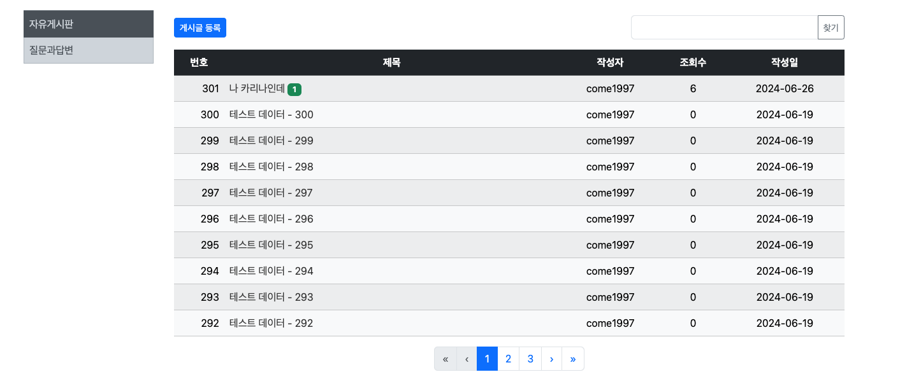

5. DB를 `Oracle` -> `H2`로 변경
- `application.porperties`에서 `Oracle` 관련 코드 주석 및 `H2` 코드 설정
- `Oracle` 설정 코드는 잠시 주석 처리한다!
```shell
## H2 콘솔 설정
spring.h2.console.enabled=true
spring.h2.console.path=/h2-console
spring.datasource.url=jdbc:h2:~/test
spring.datasource.driver-class-name=org.h2.Driver
spring.datasource.username=sa
spring.datasource.password=

## 오라클 설정
#spring.datasource.url=jdbc:oracle:thin:@localhost:1521:XE
#spring.datasource.driver-class-name=oracle.jdbc.OracleDriver
#spring.datasource.username=pknusb
#spring.datasource.password=pknu_p@ss
```
#### H2 콘솔 재업로드 완료
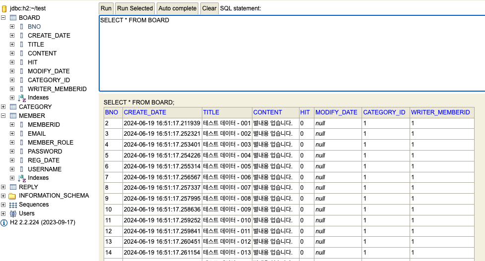

### **2. AWS 업로드**
1. [AWS 회원가입](https://signin.aws.amazon.com/signup?request_type=register)
- 신용카드가 필요하므로 해외결제가 가능한 카드로 가입한다.
> 몇달은 무료라 일단 가입..!

2. [LightSail](https://lightsail.aws.amazon.com/ls/webapp/home/instances) 접속
> Lightsail은 다양한 프로젝트를 빠르게 시작하고 관리하기 위한 용도로 설계
3. 인스턴스 -> 인스턴스 생성 클릭
- `region` 대한민국, 서울 선택

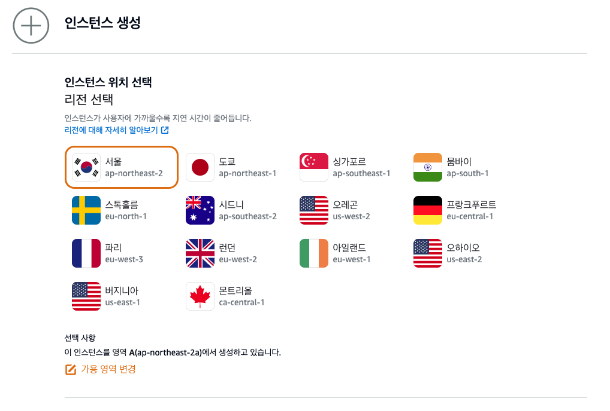

4. 인스턴스 이미지 선택 -> 플랫폼, 블루프린트 선택
- 플랫폼: `Linux/Unix`
- 운영체제(os)전용: `Ubuntu 22.04 LTS` 선택

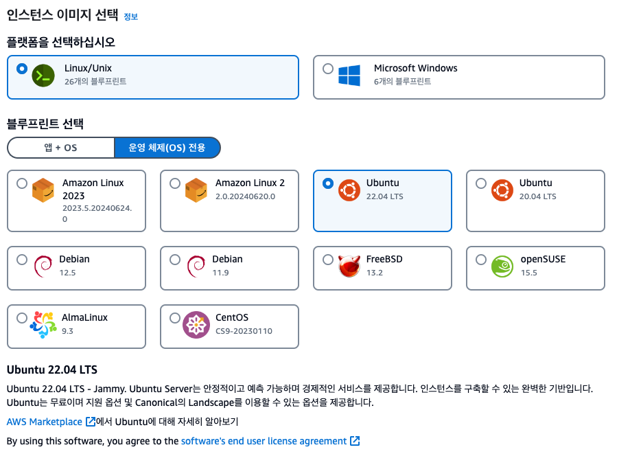

5. 인스턴스 플랜 선택
- 네트워크 유형 선택: `듀얼선택`
- 크기 선택: 월별 $12 선택 (무료 중 가장 스펙이 좋다...)

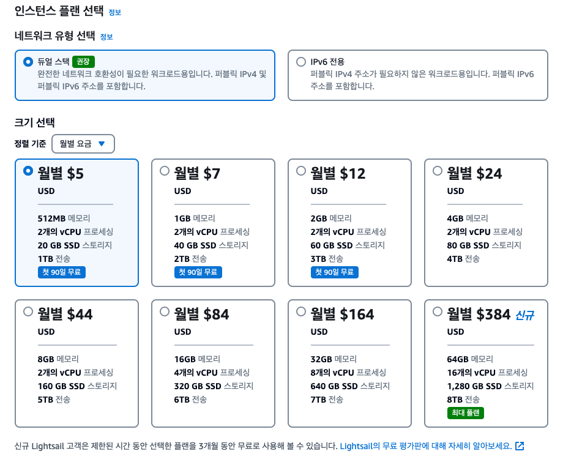

6. 인스턴스 확인
- Lightsail 리소스의 고유 이름 설정

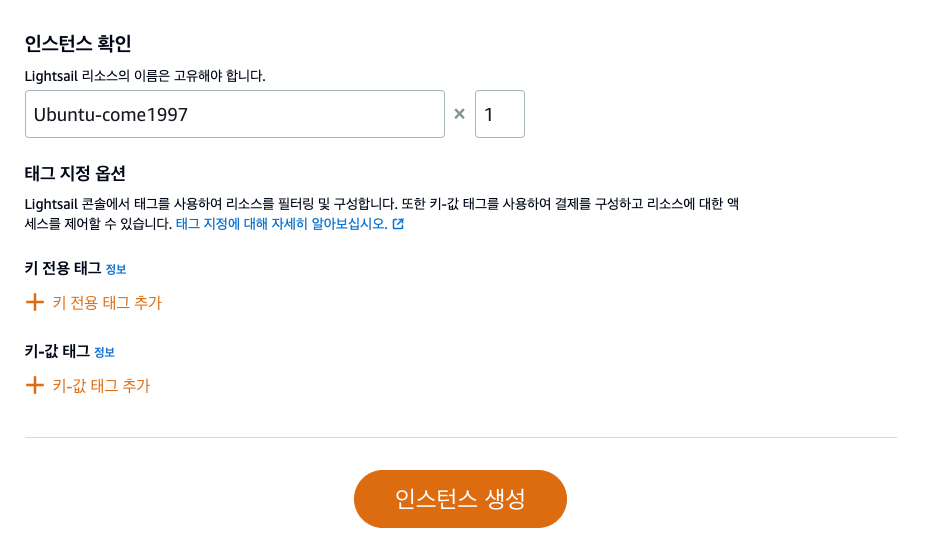

7. 인스턴스 생성 및 실행 중 확인


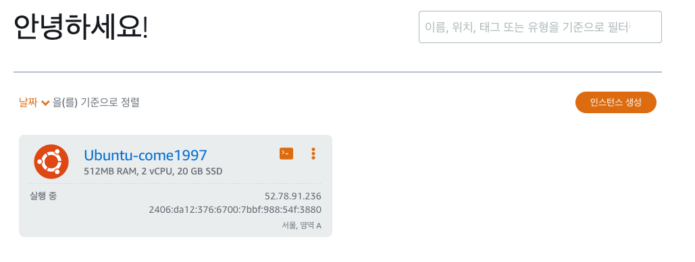


8. 관리(⁝) -> 네트워킹, 고정 IP 연결

9. IPv4 방화벽 규칙 생성
- `TCP 8080` 추가


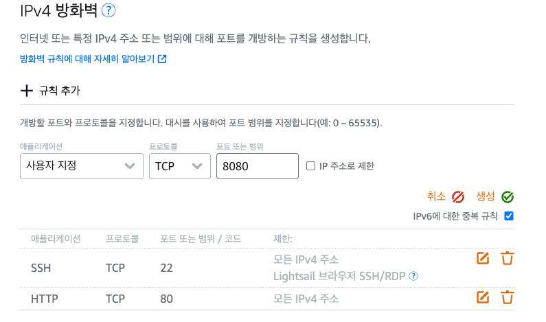

10. `PuTTY AWS` 터미널 연결

11. 계정 -> `SSH`키 -> 기본키 다운로드

12. `PuTTYgen` 실행 후 기본키 선택 `.ppk`로 저장
13. `PuTTY` 실행
- `HostName`: `AWS` 고정 IP
- `Connection`-> `SSH` -> `Auth` -> `Credentials key`를 `.ppk`로 선택
- `Session` -> `Saved Session`명 입력 -> `Save`
- `Open`후 콘솔에다가 `login as`에 `ubuntu` 

> 맥 `PuTTY` 설치는 건너뛴다. `FileZila`에서 `.pem` 파일로 열면 바로 열림

14. `FileZila` 설치
- 사이트 관리자 열기
  - 새 사이트
  - 프로토콜: `SFTP`
  - 호스트: 고정 IP 입력
  - 로그인 유형: 키 파일
  - 키 파일: `.pem` 선택


15. 설정변경
```shell
// 한국시간 변경
sudo ln -sf /usr/share/zoneinfo/Asia/Seoul /etc/localtime

// hostname 확인
hostname

// hostname 변경
sudo hostnamectl set-hostname come1997

// 재부팅
sudo reboot

// 전체서버 패키지 업데이트
sudo apt-get update

java

sudo apt-get install openjdk-17-jdk

> Do you want to continue ? -> y

java --version

> openjdk 17.0.11 2024-04-16
> OpenJDK Runtime Environment (build 17.0.11+9-Ubuntu-122.04.1)
> OpenJDK 64-Bit Server VM (build 17.0.11+9-Ubuntu-122.04.1, mixed mode, sharing)
```

> java-common이 있어서 java 충돌이 났다... java-common 삭제 후 Openjdk-17-jdk를 새로 받아 실행을 하니 연결이 되었다.

16. intelliJ의 `Gradle for Java`에서 `Tasks` -> `build` -> `bootJar`
- **SNAPSHOT.jar 파일 생성 확인**

17. `FileZila`에서 `*jar` 파일 AWS로 전송

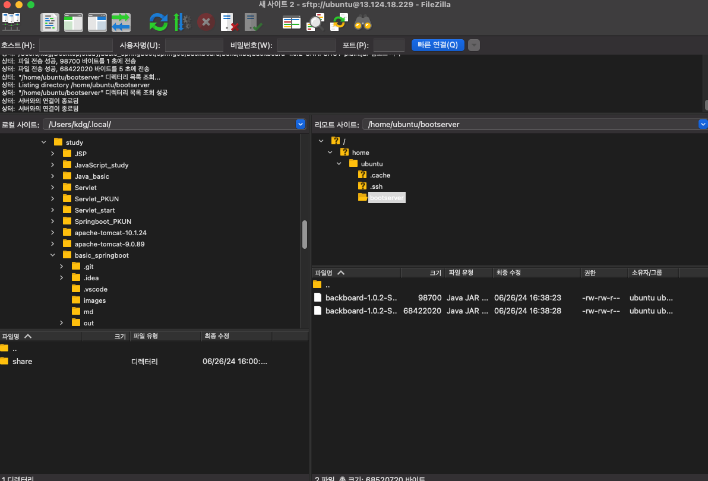

18. `PuTTY`
```shell
ls
...
cd bootserver
ls
backboard-1.0.1-SNAPSHOT.jar

sudo java -jar backboard-1.0.1-SNAPSHOT.jar
```


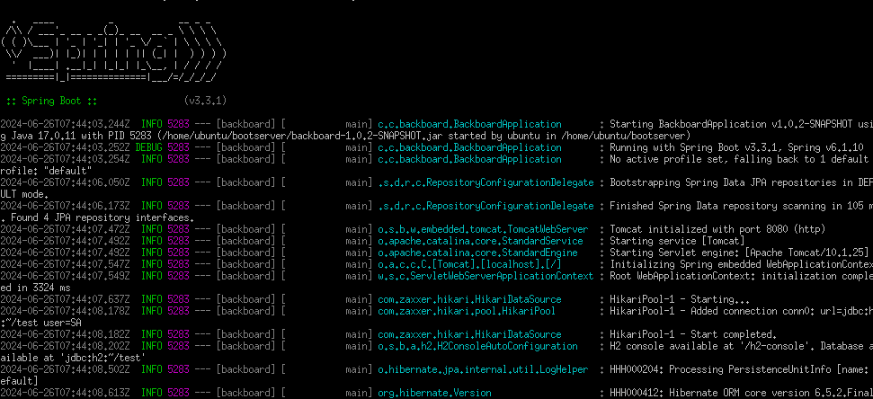


19. 스프링부트 서버 백그라운드 실행 쉘 작성
- nano start.sh
```shell
#!/bin/bash

JAR=backboard-1.0.2-SNAPSHOT.jar
LOG=/home/ubuntu/bootserver/backbord_log.log
nohup java -jar $JAR > $LOG 2>&1 &
```
- 파일권한 바꾸기(실행가능)
```shell
 > chmod +x start.sh
```

- nano stop.sh
```shell
#!/bin/bash

BB_PID=$(ps -ef | grep java | grep backboard | awk '{print $2}')

if [ -z "$BB_PID" ];
then
   echo "BACKBOARD is not running"
else
   kill -9 $BB_PID
   echo "BACKBOARD terminated!"
fi
```
- 파일권한 바꾸기(실행가능)
```shell
 > chmod +x stop.sh
```

- 서버실행

> `Amazon`의 ip주소 + port 번호를 치면 프로그램을 실행하지 않아도 접속이 가능해진다..! 

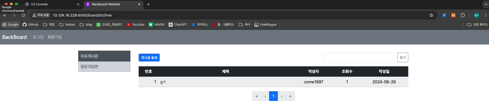


