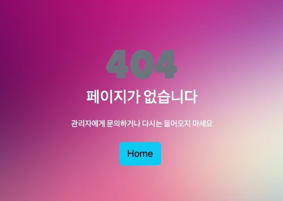
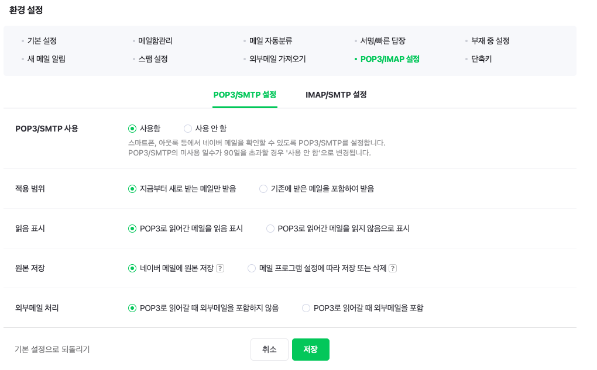
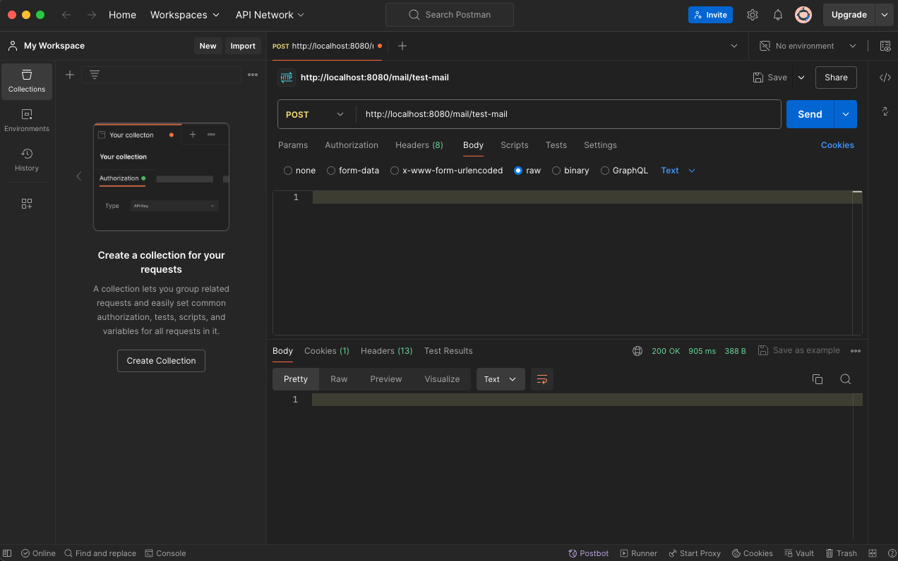
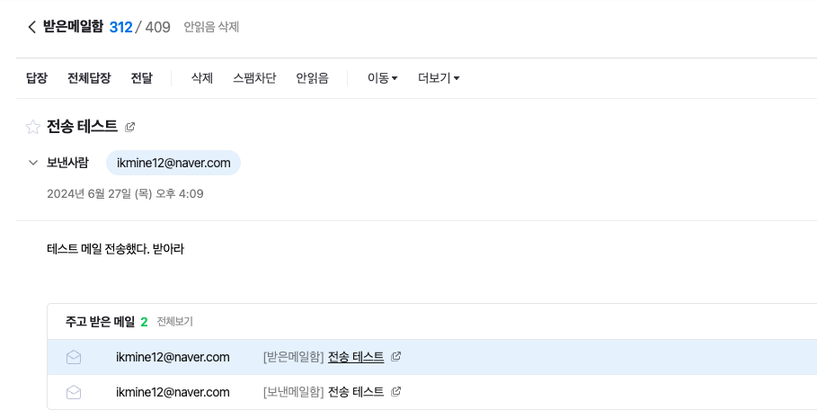

## 12일차

### 목차
#### Spring Boot JPA 프로젝트 개발
1. 에러페이지 작업 (404, 500...etc)
2. 비밀번호 초기화
    - 확인 메일 받기

#### **1. 에러페이지 작업**
1. `application.properties`에 에러페이지 관련 설정 추가
```shell
server.error.whitelabel.enabled=false
server.error.path=/error
spring.autoconfigure.exclude=org.springframework.boot.autoconfigure.web.ErrorMvcAutoConfiguration
```
2. `resource/img`생성 후 `.jpeg` 저장
3. `404.html`, `500html`, `error.html` 페이지 작성
#### 404.html
```html
<!DOCTYPE html>
<html>
<head>
    <meta charset='utf-8'>
    <meta http-equiv='X-UA-Compatible' content='IE=edge'>
    <title>404 Error</title>
    <meta name='viewport' content='width=device-width, initial-scale=1'>
    <!--bootstrap-->
    <link rel="stylesheet" href="https://cdn.jsdelivr.net/npm/bootstrap@5.3.3/dist/css/bootstrap.min.css"
          integrity="sha384-QWTKZyjpPEjISv5WaRU9OFeRpok6YctnYmDr5pNlyT2bRjXh0JMhjY6hW+ALEwIH" crossorigin="anonymous">
    <link href="https://maxcdn.bootstrapcdn.com/font-awesome/4.3.0/css/font-awesome.min.css" rel="stylesheet">

    <!-- Favicon 탭에 들어가는 아이콘-->
    <link rel="icon" href="https://getbootstrap.com//docs/5.3/assets/img/favicons/favicon-32x32.png" sizes="32x32" type="image/png">
    <link rel="icon" href="https://getbootstrap.com//docs/5.3/assets/img/favicons/favicon-16x16.png" sizes="16x16" type="image/png">
</head>
<body>
<section class="p-0 bg-img cover-background" style="background-image: url(https://bootdey.com/img/Content/bg1.jpg);">
    <div class="container-fluid d-flex flex-column">
        <div class="row align-items-center justify-content-center min-vh-100">
            <div class="col-md-9 col-lg-6 my-5">
                <div class="text-center error-page">
                    <h1 class="mb-0 text-secondary" style="font-family: 'Lilita One' !important; font-weight: 800; font-size: 80px">404</h1>
                    <h2 class="mb-4 text-white" style="font-family: 'Lilita One' !important;">페이지가 없습니다</h2>
                    <p class="w-sm-80 mx-auto mb-4 text-white" style="font-family: 'Lilita One' !important;">관리자에게 문의하거나 페이지를 찾지마세요</p>
                    <div>
                        <a href="/board/list/free" class="btn btn-info btn-lg me-sm-2 mb-2 mb-sm-0">Home</a>
                    </div>
                </div>
            </div>
        </div>
    </div>
</section>

<script src="https://cdn.jsdelivr.net/npm/bootstrap@5.3.3/dist/js/bootstrap.bundle.min.js"
        integrity="sha384-YvpcrYf0tY3lHB60NNkmXc5s9fDVZLESaAA55NDzOxhy9GkcIdslK1eN7N6jIeHz" crossorigin="anonymous"></script>
</body>
</html>
```
4. `CustomErrorController.java` 생성
#### CustomErrorController.java
- 404에러, 500에러, 기타에러 메서드 작성
```java
package com.come1997.backboard.controller;

import jakarta.servlet.RequestDispatcher;
import jakarta.servlet.http.HttpServletRequest;
import org.springframework.boot.web.servlet.error.ErrorController;
import org.springframework.http.HttpStatus;
import org.springframework.web.bind.annotation.RequestMapping;

public class CustomErrorController implements ErrorController {

    @RequestMapping("/errer")
    public String error(HttpServletRequest request) {
        Object status = request.getAttribute(RequestDispatcher.ERROR_STATUS_CODE);  //404, 500, 403...etc

        if(status != null) {    // null이 아니다 == error가 났다
            Integer statusCode = Integer.valueOf(status.toString());

            if (statusCode == HttpStatus.NOT_FOUND.value()) {   // 404
                return "error/404";
            } else if (statusCode == HttpStatus.INTERNAL_SERVER_ERROR.value()) {
                return "error/500"; // 가장 나면 안되는 코드....!
            }
        }

        return "error/error";   // status 코드는 없는데 오류가 남
    }
}

```
5. [구글 폰트 교체](https://fonts.google.com/)
- 위 링크 접속 후 원하는 폰트를 선택해 `Get Font` -> `Get embed Font`를 눌러 코드를 복사한다.
#### 복사한 코드의 링크를 달아주고 style 설정
```html
<!--goggle font: Lilita One-->
<link rel="preconnect" href="https://fonts.googleapis.com">
<link rel="preconnect" href="https://fonts.gstatic.com" crossorigin>
<link
    href="https://fonts.googleapis.com/css2?family=Lilita+One&family=Poppins:ital,wght@0,100;0,200;0,300;0,400;0,500;0,600;0,700;0,800;0,900;1,100;1,200;1,300;1,400;1,500;1,600;1,700;1,800;1,900&display=swap"
    rel="stylesheet">

<!--생략-->

<h1 class="mb-0 text-secondary" style="font-family: 'Lilita One' !important; font-weight: 800; font-size: 80px">404</h1>
```




#### **2. 비밀번호 초기화**
1. 메일 보내기
- `build.gradle` 메일을 보내기 위한 디펜던시 추가
```java
// 메일 전송 디펜던시
implementation 'org.springframework.boot:spring-boot-starter-mail'
```
- `application.properties`에서 메일 설정

```shell
## mail
spring.mail.host=smtp.naver.com
spring.mail.port=587
spring.mail.username=userId@naver.com ## 이메일을 받는 사람
spring.mail.password=userpassword
spring.mail.properties.mail.smtp.starttls.enabled=true
spring.mail.properties.mail.smtp.auth=true
spring.mail.properties.mail.smtp.ssl=true
spring.mail.properties.mail.smtp.ssl.trust=smtp.naver.com
```
> 네이버로 해야한다. goggle은 인증 문제 때문에 안됨...

2. `SMTP` 설정
- 네이버 메일 환경설정에서 설정을 해줘야한다!



3. *`SecurityConfig`에 `CSRF` 설정 변경...!!!*
#### 변경된 곳 주석 처리 및 리팩토링 -> 404오류 때문에 일단 변경 추후 다른 코드 있나 확인
```java
//.csrf((csrf) -> csrf.ignoringRequestMatchers(new AntPathRequestMatcher("/h2-console/**")))
.csrf((csrf) -> csrf.disable()) // REST API 전달시 404 오류가 나서 
```

4. `MailService`생성
```java
package com.come1997.backboard.service;


import org.springframework.beans.factory.annotation.Value;
import org.springframework.mail.javamail.JavaMailSender;
import org.springframework.mail.javamail.MimeMessageHelper;
//import org.springframework.security.crypto.password.PasswordEncoder;
import org.springframework.stereotype.Service;
import org.springframework.transaction.annotation.Transactional;

import jakarta.mail.MessagingException;
import jakarta.mail.internet.InternetAddress;
import jakarta.mail.internet.MimeMessage;
import lombok.RequiredArgsConstructor;

@Service
@RequiredArgsConstructor
@Transactional(readOnly = true)
public class MailService {

    //  이메일을 보내기 위한 Spring의 JavaMailSender를 주입
    private final JavaMailSender javaMailSender;
    //private final PasswordEncoder passwordEncoder;

    // application.properties 또는 application.yml 파일에서 spring.mail.username 속성 값을 가져와 from 변수에 할당
    @Value("${spring.mail.username}")
    private String from;

    public void sendMail(String to, String subject, String message) {
        MimeMessage mimeMessage = javaMailSender.createMimeMessage(); //MIME type 설정

        try {
            //MimeMessageHepler로 MimeMessage구성
            MimeMessageHelper mmh = new MimeMessageHelper(mimeMessage, false,"UTF-8");
            // 이메일 수신자 설정
            mmh.setTo(to);
            // 이메일 제목 설정
            mmh.setSubject(subject);
            // 본문내용 설정
            mmh.setText(message);
            // 이메일 발신자 설정
            mmh.setFrom(new InternetAddress(from));
            // 이메일 전송
            javaMailSender.send(mimeMessage);
        } catch (MessagingException e) {
            throw new RuntimeException(e);
        }
    }
}

```
5. `MailController` 생성
```java
package com.come1997.backboard.controller;

import com.come1997.backboard.service.MailService;
/*생략*/
import org.springframework.web.bind.annotation.RestController;

@RestController
@RequiredArgsConstructor
@RequestMapping("/mail")
public class MailController {

    private final MailService mailService;

    @PostMapping("/test-mail")
    @ResponseBody
    public ResponseEntity testEmail() {
        // 서로 주고 받기
        String to = "ikmine12@naver.com";   // 전송하는 사람
        String subject = "전송 테스트";     // 전송 제목
        String message = "테스트 메일 전송했다. 받아라";    // 전송 메세지

        mailService.sendMail(to, subject, message);
        return new ResponseEntity<HttpStatus>(HttpStatus.OK);
    }
}

```

6. `POSTMAN`으로 `POST 요청



7. 네이버 메일 확인
#### 전송 성공!!!!!!


8. 로그인 화면에서 비밀번호 초기화 버튼을 누르면 `AJAX`로 `RestAPI`로 메일 보내기
9. 메일에 링크 클릭


