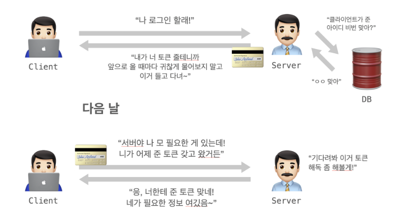
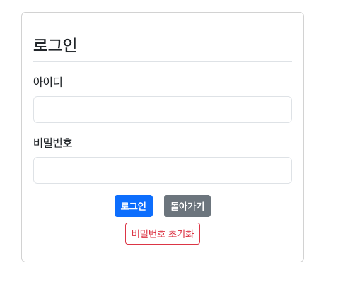
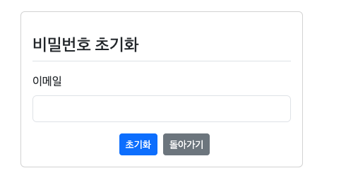
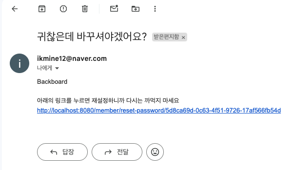

## 13일차

### 목차
#### Spring Boot JPA 프로젝트 개발
1. 비밀번호 초기화 (계속)


> 메일 작업 중 생긴 오류
> 
> 로그인 후 게시글 등록을 누르면 **500에러**
> - `CSRF` 토크 때문에 발생하는 에러
> - `create.html`, `modify.html`의 `csrf`관련 태그 주석처리 해야한다.

➡️ `CSRF`: 다른 사이트에서 유저가 보내는 요청을 조작하는 공격. 예시로는 이메일에 첨부된 링크를 누르면 내 은행계좌의 돈이 빠져나가는 방식의 해킹 등이 있다.
회원가입시 페이지를 바꿔치기 하는등의 방법으로 해킹을 하기도 하기 때문에 이를 방지하기 위한것이 CSRF 토큰

➡️ `CSRF 토큰`: 서버에 들어온 요청이 실제 서버에서 허용한 요청이 맞는지 확인하기 위한 토큰



#### **1. 비밀번호 초기화**

1. `login.html`에 비밀번호 초기화 버튼 설정
```html
<!--비밀번호 초기화-->
<div class="d-flex justify-content-center">
    <a href="/member/reset" class="btn btn-sm btn-outline-danger my-2">비밀번호 초기화</a>
</div>
```



2. `MemberController`에 `reset` 메서드 작성
```java
// 비밀번호 초기화
@GetMapping("/reset")
public String reset() {
    return "member/reset";
}
```

3. `reset.html` 생성 후 `GetMapping` 되었는지 확인
#### 잘되었음!!



5. `MainController` 생성, `mail/reset-mail` `GetMapping`

6. `MemberService`에 메일주소로 검색하는 메서드 생성

7. `MailService`에 메일 전송 메서드 생성 및 수정
```java
// 메일 보내기
// PW 초기화 메일 보내기 메서드
public boolean sendResetPasswordEmail(String email) {
    // 제목
    String subject = "귀찮은데 바꾸셔야겠어요?";
    // 내용
    String message = "Backboard"
            + "<br><br>" + "아래의 링크를 누르면 재설정하니까 다시는 까먹지 마세요" + "<br"
            + "<a href='" + resetPwUrl + "/" + email + "'>"
            + resetPwUrl + "/" + email + "</a>" + "<br><br>";

    try {
        sendMail(email, subject, message);
        return true;
    } catch (Exception e) {
        return false;
    }
}
```


8. `UUID`를 생성해서 메일로 전송하는 기능 추가
> ### `UUID`란 네트워크 상에서 고유성이 보장되는 `id`를 만들기 위한 표준 규약이다. 
9. `Reset`생성
```java
@Data
@Entity
@Builder
@NoArgsConstructor
@AllArgsConstructor
public class Reset {
    @Id
    @GeneratedValue(strategy = GenerationType.SEQUENCE)
    private Integer id;

    private String email;

    private String uuid;

    @CreatedDate
    @Column(updatable = false)
    private LocalDateTime regDate;
}
```
10. `ResetRepository` 인터페이스 생성,  `findByUuid()`추가
```java
public interface ResetRepository extends JpaRepository<Reset, Integer> {
    Optional<Reset> findByUuid(String uuid);
}
```


11. `ResetService` 생성
> `setReset()`
> - 주어진 UUID와 이메일을 사용하여 Reset 객체를 생성하고 데이터베이스에 저장하는 메소드
> 
> `getReset()`
> - 주어진 UUID를 사용하여 데이터베이스에서 Reset 객체를 조회하는 메소드

```java
@RequiredArgsConstructor
@Service
@Log4j2
public class ResetService {

    private final ResetRepository resetRepository;

    public void setReset(String uuid, String email) {
        Reset reset = Reset.builder().uuid(uuid).email(email).regDate(LocalDateTime.now()).build();

        this.resetRepository.save(reset);
        log.info("■ ■ ■ ■ ■ setReset() 성공!!!");
    }

    public Reset getReset(String uuid){
        Optional<Reset> _reset = this.resetRepository.findByUuid(uuid);

        if(_reset.isPresent()) {
            return _reset.get();
        } else {
            throw new NotFoundException("Reset not found!");
        }
    }
}

```


12. `MailService`에 `ResetService`객체 생성
- 메일 전송 후 `setReset()` 사용

```java
// PW 초기화 메일 보내기 메서드
@Transactional
public Boolean sendResetPasswordEmail(String email) {

    String uuid  = makeUuid();
    String subject = "귀찮은데 바꾸셔야겠어요?";
    String message = "Backboard"
            + "<br><br>" + "아래의 링크를 누르면 재설정하니까 다시는 까먹지 마세요" + "<br>"
            + "<a href='" + resetPwUrl + "/" + uuid + "'>"
            + resetPwUrl + "/" + uuid + "</a>" + "<br><br>";

    try {
        sendMail(email, subject, message);
        return true;
    } catch (Exception e) {
        return false;
    }
}
```
> 생성한 uuid가 메일로 온다




13. `MemberController`에 `reset-password` `GetMapping` 메서드 작성
```java
// 비밀번호 초기화 창
@GetMapping("/reset-password/{uuid}")
public String getMethodName(MemberForm memberForm, @PathVariable("uuid") String uuid) {
    log.info("Accessing reset-password page with UUID: " + uuid);
    Reset reset = this.resetService.getReset(uuid);
    log.info(String.format("▶ ▶ ▶ ▶ ▶ 확인된 이메일 : [%s]", reset.getEmail()));

    Member member = this.memberService.getMemberByEmail(reset.getEmail());
    memberForm.setUsername(member.getUsername());
    memberForm.setEmail(member.getEmail());

    return "member/newpassword";
}
```

14. `newpassword.html` 작성
15. `MemberController`에 `reset-passowrd` `PostMapping` 메서드 작성
> 
```java
// 비밀번호 유효성 검사 및 재설정 로직
@PostMapping("/reset-password")
/*객체와 검증 결과를 반환, 객체의 유효성을 검사, 객체 유효성 검사 결과를 포함*/
public String reset_password(@Valid MemberForm memberForm, BindingResult bindingResult) {
    if(bindingResult.hasErrors()) {
        return "member/newpassword";
    }
    /*비밀번호와 비밀번호 확인이 != 이라면 필드에 오류 메세지 반환*/
    if(!memberForm.getPassword1().equals(memberForm.getPassword2())) {
        bindingResult.rejectValue("password2", "passwordInCorrect", "패스워드가 일치하지 않습니다.");
        return "member/register";
    }
    
    Member member = this.memberService.getMember(memberForm.getUsername()); // 현재 사용자 가져오기
    member.setPassword(memberForm.getPassword1());  // 입력된 패스워드 받아와서 변경

    this.memberService.setMember(member);   // 업데이트

    return "redirect:/member/login";
}
```
16. `MemberService`에 `setMember()` 메서드 추가
```java
// 기존 사용자 비밀번호 초기화
public void setMember(Member member) {
    member.setPassword(passwordEncoder.encode((member.getPassword()))); // Bcrypt 암호화로 업데이트
    this.memberRepository.save(member);     // 업데이트
}
```
#### 기존 비밀번호 12345에서 ikmine12 로 변경 완료 !!!!!


