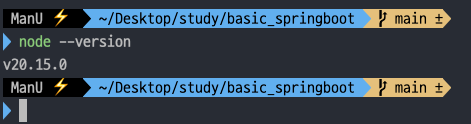
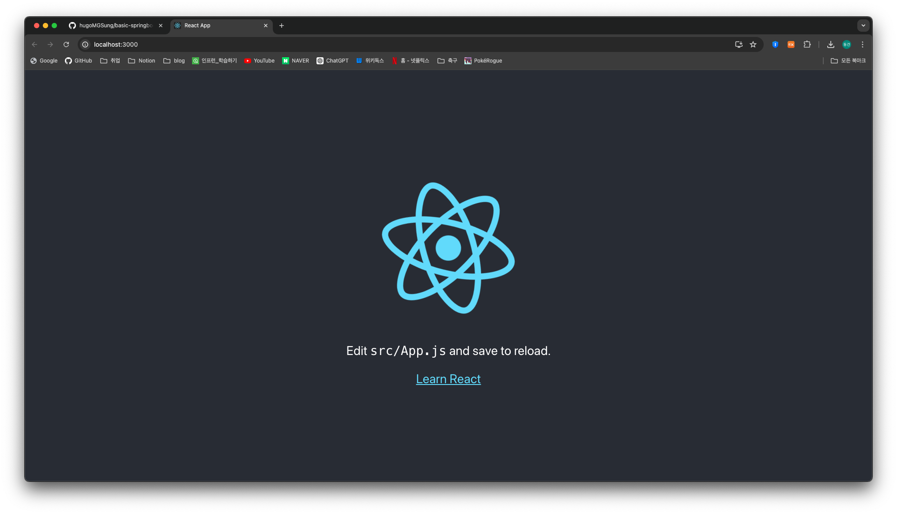
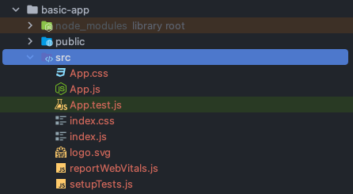
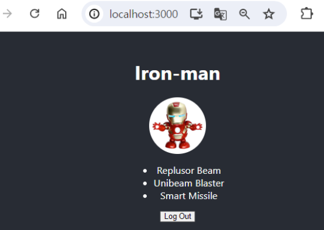

## 14일차

### 목차
1. 리액트 개요
2. 리액트 설치
3. 리액트 기초
4. 리액트 추가 내용

#### **1. 리액트 개요**
- 서버사이드 -> 백엔드
- 클라이언트사이드 -> 프론트엔드
- 프론트엔드 : html+css+js(html, jsp, aspx, php, ...)
- `js`만 가지고 프론트엔드를 만들어보자 -> 리액트
- `css`는 있어야 하는 구나!
- 페이스북이 자기 웹페이지 프론트를 좀더 개선해보고자 개발 시작
- 리액트는 기본적으로 SPA(Single Page Application)을 목적으로
- node.js 서버사이드 js를 사용해서 서버를 동작
- 패키지 매니저 종류 : npm, chocolatey, yarn, ...(본인이 필요한 것만 공부)

#### **2. 리액트 설치**
1. `node.js` 설치
- [node.js Download](https://nodejs.org/en)에서 LTS 다운로드
- 콘솔에서 `node --version`으로 설치 및 버전 확인



2. 리액트 패키치 설치
```shell
npm uninstall -g create-react-app

npm install -g create-react-app
```

3. 리액트 프로젝트 초기화
- intelliJ 터미널 오픈
```shell
npx create-react-app basic-app
```

4. 툴 내에서 만든 프로젝트 앱 이름까지 진입 -> `basic-app`
```shell
npm start
```

5. 웹 브라이주 http://localhost:3000 서버 열리는것 확인
- `node.js`가 3000포트로 웹서버를 실행
- 웹서버가 실행된 상태에서 개발하는 환경이 가장 좋다!
- `index.html` (`jsp`, `php`)가 맨 처음 화면인데 `App.js`가 메인 개발 부분이다.






6. 리액트 기본구조 및 개발방법
- 깃헙 `.gitignore`에 `react` 관련 설정 추가
- 깃헙 `.gitignore`에 먼저 커밋 후 푸시
  - `src/App.css`, `App.js`, `index.js` 파일만
- `javascript`이기 때문에 `js` 위주로 개발한다.
- `App.js`부터 개발을 시작하면 된다.

#### **3. 리액트 기초**
1. `html`의 태그처럼 개발자가 새로운 **요소(객체)** 를 생성할 수 있다.

```javascript
function CustomButton() { // CustomButton 객체 생성
	return (
		<button>MyButton</button>
	);
}
```

2. `CustomeButton.js` 생성
- 같은 파일이 아닌 곳에 객체를 만들면 안된다.
- 가져와 쓰기 위해서 `export default` 객체이름 **;** 은 필수이다.

3. `React`문법은 `JSX`이며, 일반 `js`와 조금 차이가 있다.
- `className`은 `JSX`에만 존재한다.
- `HTML`에 있던 `class`는 `JSX`에서 `className`으로 변경한다.
- 인라인으로 `style`을 쓸때 `CSS` 명칭이 다르다.
  - 대신 `*.css`파일로 작업할 때는 기존 그대로 사용해도 무방하다.
- `JSX` 문법에는 모든 요소는 상위 태그 하나에 속해야 한다.
    - https://transform.tools/html-to-jsx 를 참조하자!

4. 데이터 화면에 표시하기
- 변수 생성시에 `const`를 많이 쓴다.
- 변수 사용할 때 중괄호 `{}` tkdldp dlqfurgksek.
- `CSS`를 `*.css` 파일에 작성할 때는 `html`에서 사용할 때와 동일하다.
  - ex) `border-radius: 50%`
- `JSX`에서 사용할때는 변경
  - ex) `border-radius: '50%'`
> 리액트에서 `css`를 쓸때는 `*.css`파일로 작업한다!!


5. 조건부 랜더링
- 특정 값에 따라서 다른 컴포넌트를 그리고 싶을 때 사용하는 방법으로, 웹 상에서 여러 방법을 확인할 수 있다.

```javascript
function CustomButton() {   // 함수형 컴포넌트 선언
	let isLoggedIn = false; // 로그인여부
	let content;

  // 로그인이 되었다면 로그아웃 버튼, 아니라면 로그인 버튼
	if (isLoggedIn) {
		content = <button>Log Out</button>;        
	} else {
		content = <button>Log In</button>;
	}
	return (
		<>
			{content}            
		</>
	);
}
```

```javascript
{
	isLoggedIn ? (
		<button>Log Out</button>
	) : (
		<button>Log In</button>
	)
}
```

6. 목록 표시
- `for`, `map()` 함수를 많이 사용한다.
- `map()`을 쓰면 `for`문보다 짧게 구현이 가능하다.
- 각 `child` 요소마다 `key`속성이 필요하다. 
    - 없으면 경고..!!



7. 이벤트 핸들링
- `form + onSubmit`, `tag + onClick`
- 이벤트 파라미터를 전달
- 파라미터가 필요해서 함수 뒤에 `()`를 쓰면 이벤트 순서에 따라 리플레시 후 자동 실행된다.
- `onClick = {() => function()}` 람다식으로 변경...!

8. 컴포넌트 간 데이터 전달
- `props` 속성
- `props.속성이름.key이름`


9. 화면 업데이트
- `useState`: 앱 화면의 상태를 기억하고, 사용하기 위한 함수
  - `import {useState} from 'react';`는 필수
- `useEffect`: 컴포넌트에서 사이드 이펙트를 수행할때 사용한다.
- 기타: `useContext`, `useReducer`, `userCallback`, `useRef`...etc

#### **4. 리액트 추가 내용**
1. 리액트 관련 프레임 워크
> - `Next.js`: 풀스택 `React` 프레임 워크
> - `Gastsby`: 정적 사이트 `React` 프레임 워크
> - `React Native`: Andriod, IOS 멀티플랫폼 모바일 프레임 워크

2. `npm`으로 추가 라이브러리 설치
```shell
npm install react react-dom
```

3. 리액트 개발자 도구
- 크롬 브라우저별로 따로 존재한다.
- `React Developer Tools` 설치

