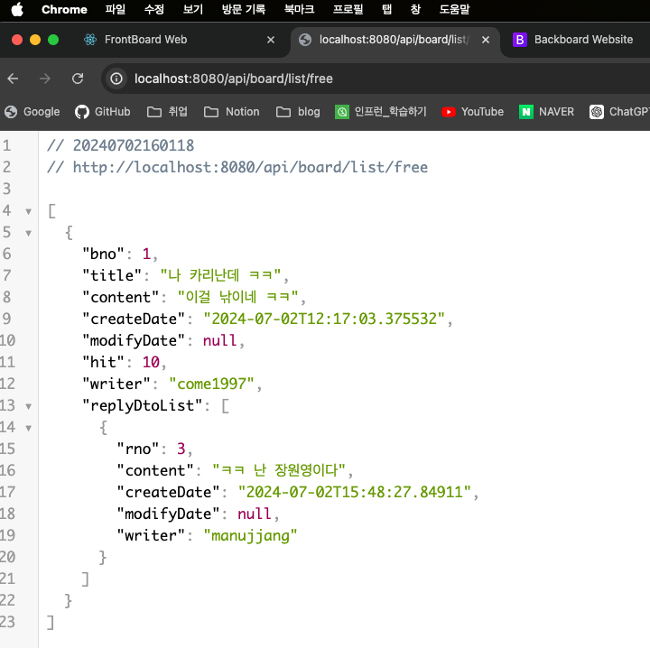
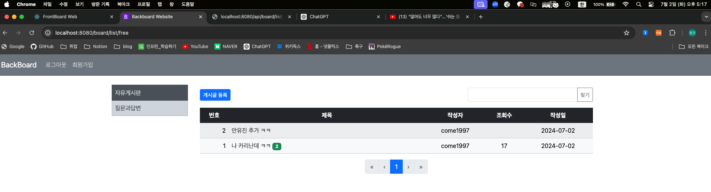

## 15일차

### 목차

1. Spring Boot React 연동 프로젝트 개발 


#### **1. Spring Boot React 연동 프로젝트 개발
1. 리액트 라이브러리 설치 
- 리액트용 `BootStrap` 설치
```shell
npm install react-bootstrap bootstrap
```
- **TIP `npm audix fix --force`는 절대 하지 말것!!!**

- `npm install axios` -> RESP API 통신
- `npm install react-router-dom` -> 리액트 화면 네비게이션
- `npm install react-js-pagination` -> 리액트 페이징처리

2. `frontboard` 개발 시작
- 수정할 것들 수정 및 삭제
  - `log.svg`삭제, `App.js` -> `react-router-dom` 사용
  - `index.js` -> `reportWebVitials()`, `<React.StrictMode>` 삭제

- `layout` 패키지 생성 후 `Header.js`, `Footer.js` 파일 생성
- `routes` 패키지 생성 후 `Home.js`, `BoardList.js`, `QnaList.js`, `Login.js` 파일 생성
```js
// 각 메서드명 파일명에 맞게 변경
function Home() {
    return (
        <div className="container main">
            <h1>Home</h1>
        </div>
    );
}

export default Home;
```
- `App.js`에 `Routes` 화면 추가
```js
// 만든 화면 추가
import Home from './routes/Home';
import BoardList from './routes/BoardList';
import QnaList from './routes/QnaList';
import Login from './routes/Login';

function App() {
    return (
        <Routes>
            {/* a, Link 링크를 누르면 화면으로 전환될 페이지*/}
            <Route path="/home" element={< Home />} />
            <Route path="/boardList" element={< BoardList />} />
            <Route path="/qnaList" element={< QnaList />} />
            <Route path="/login" element={< Login />} />
        </Routes>
    );
}
```
- `Header.js`에 `react-router-dom` 추가, `Link`, `useNavigate` 사용
```js
<ul className="nav col-12 col-md-6 justify-content-center">
  <li><Link to = "/home" className="nav-link px-2 link-secondary">HOME</Link></li>
  <li><Link to = "/boardList" className="nav-link px-2 link-secondary">BOARD</Link></li>
  <li><Link to = "/qnaList" className="nav-link px-2 link-secondary">Q&A</Link></li>
</ul>
```


3. `backboard`에 `Rest API` 추가
- `RestController.java` 생성 후 `BoardController`에 있는 메서드 복사
- Spring Boot와 Rest API 간의 리턴 데이터 차이 때문에 100% 호환은 안된다.

```java
  @RequiredArgsConstructor
  @RequestMapping("/api/board")
  @RestController
  @Log4j2
  public class RestBoardController {

    private final BoardService boardService;
    private final MemberService memberService;
    private final CategoryService categoryService;


    @GetMapping("/list/{category}")
    public List<Board> list(
                       @PathVariable(value = "category") String category,
                       @RequestParam(value = "page", defaultValue = "0") int page,
                       @RequestParam(value = "kw", defaultValue = "") String keyword) {

        Category cate = this.categoryService.getCategory(category); // cate는 Category 객체 변수 사용 X
        Page<Board> paging = this.boardService.getList(page, keyword, cate);  // 검색 및 카테고리 추가
        List<Board> list = paging.getContent();
        log.info(String.format("==========리스트에서 넘긴 게시글 수 %s", list.size()));
        
        // 게시글 리스트 반환
        return list;
    }
}
```

> 링크를 걸었던 `/api/board/list/{categoey}`를 들어가면 저정되어있던 게시글 리스트가 반환되면서 JSON DATA로 나오는것을 확인 할 수있다!!
> - 크롬에서 JSON Viewer 확장자 프로그램을 설치 받아야한다!!!

#### `localhost:8080/api/board/list/free`


#### `localhost:8080/api/board/list/qna`


4. `BoardList.js` 로직 구현

> Trouble Shooting
> 
> - Spring Boot에서 만든 `Entity`는 `Board`와 `Reply` 등의 `OneToMany`, `ManyToOne` 어노테이션이 `JSON`
으로 변환할 때 문제가 발생!!!
> - `RestAPI`에서는 다른 클래스를 사용해야 한다.... 엔티티 변환로직 새로 생성하자

- `BoardDto.java` 생성
```java
@Data
@Builder
@NoArgsConstructor
@AllArgsConstructor
public class BoardDto {
    private long bno;
    private String title;
    private String content;
    private LocalDateTime createDate;
    private LocalDateTime modifyDate;
    private Integer hit;
    private String writer;

  private List<ReplyDto> replyDtoList;
}
```
- `ReplyDto` 생성
```java
@Data
@Builder
@NoArgsConstructor
@AllArgsConstructor
public class ReplyDto {
    private Long rno;
    private String content;
    private LocalDateTime createDate;
    private LocalDateTime modifyDate;
    private String writer;
}


```
- `RestBoardController.java` 생성

> ### Stream, map
>
> `Stream`: 컬랙션이나, 배열에 대한 연산을 함수형 프로그래밍 스타일로 처리한다. 데이터를 필터링, 변환, 집계하는 등의 작업을 체이닝 방식으로 처리 할수 있다.
>
> `map`: `Stream API`의 메소드이며, 각 요소를 주어진 함수에 적용하여 다른 타입의 요소로 변환한다. 원래 스트림의 요소는 그대로 유지되고, 변환된 요소들로 새로운 스트림이 생성된다.


```java
  @RequiredArgsConstructor
  @RequestMapping("/api/board")
  @RestController
  @Log4j2
  public class RestBoardController {

    private final BoardService boardService;
    private final MemberService memberService;
    private final CategoryService categoryService;

    @GetMapping("/list/{category}")
    @ResponseBody
    public List<BoardDto> list(
            @PathVariable(value = "category") String category,
            @RequestParam(value = "page", defaultValue = "0") int page,
            @RequestParam(value = "kw", defaultValue = "") String keyword) {

        Category cate = this.categoryService.getCategory(category);
        Page<Board> paging = this.boardService.getList(page, keyword, cate);

        //
        List<BoardDto> result = paging.stream().map(board -> {
            // replies 객체 선언
            List<ReplyDto> replies = board.getReplyList().stream().map(reply -> ReplyDto.builder()
                    .rno(reply.getRno())
                    .content(reply.getContent())
                    .writer(reply.getWriter().getUsername())
                    .createDate(reply.getCreateDate())
                    .build()).collect(Collectors.toList());

            // BoardDto 리턴
            return BoardDto.builder()
                    .bno(board.getBno())
                    .title(board.getTitle())
                    .content(board.getContent())
                    .createDate(board.getCreateDate())
                    .modifyDate(board.getModifyDate())
                    .writer(board.getWriter().getUsername())
                    .hit(board.getHit())
                    .replyDtoList(replies)  // replies 리턴
                    .build();
            // 리스트를 수집하여 result 리스트에 저장
        }).collect(Collectors.toList());

        log.info(String.format("==========리스트에서 넘긴 게시글 수 %s", result.size()));

        return result;
    }
}
```
> 1. 스트림생성
> - `paging.stream()`을 호출해 `Stream<Board>` 생성
> 2. `map` 사용
> - `map` 메소드를 사용해 `Stream<Board>`의 각 `Board` 객체를 `BoardDto` 객체로 변환한다.
> 3. `ReplyDto` 리스트 생성
> - 각 `Board`객체의 `getReplyList()` 메소드를 호출하여 `List<Reply>`를 가져온다.
> - `replyList.stream()`을 호출해 `Stream<Reply>`의 각 `Reply` 객체를 `ReplyDto`로 변환한다.
> - `builder()`를 사용하여 `ReplyDto`객체를 생성하고, 필요한 필드를 설정한다.
> - `collect(Collectors.toList())`를 사용해 `Stream<ReplyDto>`를 `List<ReplyDto>`로 변환한다.
> 4. `BoardDto`객체 생성
> - `.builder()`를 사용해 `BoardDto`객체를 생성한다.
> - `Board`객체의 필드를 `BoardDto` 객체에 설정한다.
> - 변환된 `List<ReplyDto>`를 `ReplyDtoList` 필드에 설정한다.
> - 완선된 `BoardDto`객체를 반환한다.
> 5. 최종 리스트 생성
> - `Stream<BoardDto>`를 `collect(Collectors.toList())`를 사용해 `List<BoardDto>`로 변환된다.
> - 이 리스트가 `result`에 저장되며 반환된다....!!!!


5. `Cors` 설정
> `CORS (Cross-Origin Resource Sharing)`은 웹 브라우저에서 다른 도메인 간의 리소스 요청을 제어하는 보안 기능, 시큐리티에서 `CORS` 설정을 적용하면 특정 도메인에서 오는 요청을 허용하거나 차단할 수 있다.
#### SecurityConfig.java
```java
  package com.come1997.backboard.security;
  @Configuration
  @EnableWebSecurity
  @EnableMethodSecurity(prePostEnabled = true) 
  public class SecurityConfig {

    @Bean
    SecurityFilterChain securityFilterChain(HttpSecurity http) throws Exception {
        http.authorizeHttpRequests((atr) -> atr.requestMatchers(new AntPathRequestMatcher("/**"))
                        .permitAll())
                // cors 설정 추가된 부분
                .cors(corsConfig -> corsConfig.configurationSource(corsConfigurationSource()))
                .csrf((csrf) -> csrf.disable())
                .headers((headers) -> headers.addHeaderWriter((new XFrameOptionsHeaderWriter(
                        XFrameOptionsHeaderWriter.XFrameOptionsMode.SAMEORIGIN))))
                .formLogin((fl) -> fl.loginPage("/member/login").defaultSuccessUrl("/"))
                // 로그아웃 처리
                .logout((logout) -> logout.logoutRequestMatcher(new AntPathRequestMatcher("/member/logout")).logoutSuccessUrl("/").invalidateHttpSession(true));

        return http.build();
    }

    // cors 메서드 추가
    @Bean
    CorsConfigurationSource corsConfigurationSource() {
      return request -> {
        CorsConfiguration configuration = new CorsConfiguration();
        // 허용할 헤더 설정
        configuration.setAllowedHeaders(Collections.singletonList("*"));
        // 허용할 HTTP 메소드 설정
        configuration.setAllowedMethods(Collections.singletonList("*"));
        // 허용할 Origin 패턴 설정 (여기서는 http://localhost:3001만 허용)
        configuration.setAllowedOriginPatterns(Collections.singletonList("http://localhost:3000"));
        // 자격 증명 허용 여부 설정 (쿠키, 인증 헤더 등)
        configuration.setAllowCredentials(true);
        return configuration;
      };
    }
```
#### localhost:3001/boardList의 콘솔창에 게시글, 댓글 데이터가 들어온다!!!


6. `BoardList.js`에 데이터 가져오기
```javascript
// Rest API의 호출 핵심 (없으면 아예 안됨!)
import axios from "axios";
// Hook 함수
import React, {useEffect, useState} from "react";
// Navigation
import {Link, useNavigate} from "react-router-dom";


function Board() {  // 객체를 만드는 함수
    // 변수 선언
    const [boardList, setBoardList] = useState([]); // 배열값을 받아 상태를 저장하기 때문에 []

    // 함수 선언: 가장 중요!!!
    // API 엔드포인트에서 데이터를 가져온다
    const getBoardList = async () => {
        var pageString = 'page=0';
        const response = (await axios.get("http://localhost:8080/api/board/list/free?" + pageString)).data;
        setBoardList(response);    // 상태를 boardList 데이터에 저장
        console.log(boardList);
    }

    /*함수를 호출하여 API 요청을 보낸다*/
    useEffect(() => {
        getBoardList();
    }, [])

    return (
            /*테이블 헤더*/
        <div className="container">
            <table className="table">
                <thead className="table-dark">
                <tr className="text-center">
                    <th>No</th>
                    <th style={{width: '50%'}}>Title</th>
                    <th>Author</th>
                    <th>Views</th>
                    <th>Date</th>
                </tr>
                </thead>
              <tbody>
                {/*반복적으로 들어갈 부분*/}
                {boards.map((board) => (
                        <tr className="text-center" key={board.bno}>
                          <td className="col-1">{board.bno}</td>
                          <td className="col-6 text-start">{board.title}</td>
                          <td className="col-2">{board.writer}</td>
                          <td className="col-1">{board.hit}</td>
                          <td className="col-2">{board.createDate}</td>
                        </tr>
                ))}
              </tbody>
            </table>
        </div>
    );
}

export default Board;
```
#### 각 board 객체를 테이블 행으로 렌더링


#### 게시글 하나 더 추가!



- **http://localhost:8080/board/list/free** 에 게시글을 새로 등록하여도 데이터가 잘 넘어온다 


