## 16일차

### 목차

#### Spring Boot React 연동 프로젝트 개발 
1. 스프링부트 서버가 실행되지 않았을 때
2. 페이징
3. 상세화면
4. 입력화면
5. 로그인


### **1. Spring Boot 서버가 실행되지 않았을 때**
- 프론트 서버부터 시작하면 `Uncaught runtime error`가 발생한다.
- `axios request`가 예외발생 되기 때문에 `try-catch` 구문으로 래핑 해주어야한다.
```javascript
  const getBoardList = async () => {
  var pageString = 'page=0';

  // 백엔드 서버가 실행되지 않으면 예외발생 >> AXIOS ERROR
  try {
      const response = (await axios.get("http://localhost:8080/api/board/list/free?" + pageString));

      if (response.status === 200) {
          setBoardList(response.data);    // 상태를 boardList 데이터에 저장
          console.log(boardList.data);

      } else if (response.status === 400) {
          alert("서버 페이지가 없습니다. 괜히 찾지 마세요.")

      } else if (response.status === 404) {
          alert("서버 오류입니다. 다시는 찾아오지 마세요.")
      }
  } catch (error) {
      console.log(">>>>>>>>" + error);
      alert("서버가 연결되지 않았습니다. 컴퓨터를 바꾸세요.");
  }
}
```
#### 스프링 부트 서버 실행 안했을 때
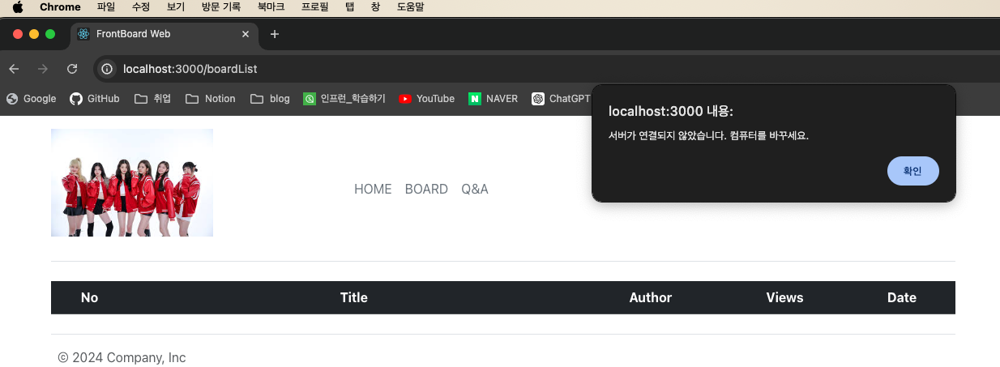

#### 스프링 부트 서버 실행했을 때
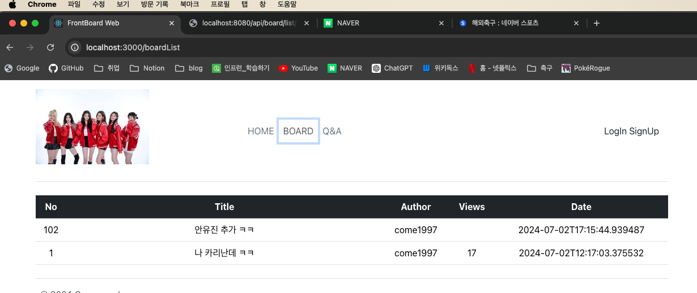


### **2. 페이징**
#### backend
1. `PagingDto`에 페이징 계산 
```java
@Data
@NoArgsConstructor
@AllArgsConstructor
@Builder
public class PagingDto {
    private int pageSize;       // 화면당 보여지는 게시글 최대 갯수
    private int totalPageNo;    // 총 페이지 수
    private long totalListSize; // 총 게시글 수

    private int pageNo;     // 현재 페이지 번호
    private int startPage;  // 시작 페이지 번호
    private int endPage;    // 마지막 페이지 번호

    private int startIndex; // 시작 인덱스 번호

    private int block;      // 현재 블럭
    private int totalBlock; // 총 블럭수
    private int prevBlock;  // 이전 블럭 페이지
    private int nextBlock;  // 다음 블럭 페이지

    public PagingDto(int pageSize, int pageNo, long totalListSize, int blockSize) {
        this.pageSize = pageSize;
        this.pageNo = pageNo;
        this.totalListSize = totalListSize;
        // 변수값 계산
        this.totalPageNo = (int) Math.ceil(this.totalPageNo * 1.0 / this.pageSize);   // 전체 블럭수 계산
        this.block = (int) Math.ceil((this.pageNo) * 1.0 / this.block); // 현재 블럭계산
        this.startPage = ((this.pageNo - 1) * this.pageSize + 1);   // 현재 블럭 시작 페이지
        this.endPage = this.startPage + this.pageSize - 1;  // 현재 마지막 페이지

        // 블럭 마지막 페이지 검증 (한 블럭이 10페이지가 안 넘으면 마지막 페이지를 최대 페이지수로 변경)
        if (this.endPage > this.totalPageNo) this.endPage = this.totalBlock;
        // 이전 블럭 (클릭 시, 이전 블럭 마지막 페이지)
        this.prevBlock = (this.block * blockSize) - blockSize;
        // 이전 블럭 검증
        if (this.prevBlock < 1) this.prevBlock = 1; // 1 페이지 보다 큼
        // 다음 블럭
        this.nextBlock = (this.block * blockSize + 1);
        // 다음 블럭 검증
        if (this.nextBlock > this.totalBlock) this.nextBlock = this.totalPageNo;
        // 시작 인덱스 번호
        this.startIndex = (this.pageNo - 1) * this.pageSize;
    }
}
```

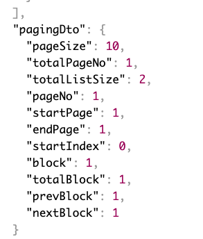

2. `Header.java` 생성
```java
@Data
@AllArgsConstructor
@NoArgsConstructor
@Builder
public class Header<T> {
    private LocalDateTime transactionTime;  // json으로 전달한 시간
    private String resultCode;              // 트랜잭션이 성공인지 실패인지
    private String description;
    private T data;  // 실제 데이터 담는곳
    private PagingDto pagingDto;

    @SuppressWarnings("unchecked")
    public static <T> Header<T> OK() {
        return (Header<T>) Header.builder()
                .transactionTime(LocalDateTime.now())
                .resultCode("OK")
                .description("No Error")
                .build();
    }
    // Data를 받아서 전달
    @SuppressWarnings("unchecked")
    public static <T> Header<T> OK(T data) {
        return (Header<T>) Header.builder()
                .transactionTime(LocalDateTime.now())
                .resultCode("OK")
                .description("No Error")
                .data(data)
                .build();
    }
    // Data와 페이징을 받아서 전달 (핵심 메서드)
    @SuppressWarnings("unchecked")
    public static <T> Header<T> OK(T data, PagingDto pagingDto) {
        return (Header<T>) Header.builder()
                .transactionTime(LocalDateTime.now())
                .resultCode("OK")
                .description("No Error")
                .data(data)
                .pagingDto(pagingDto)
                .build();
    }

    @SuppressWarnings("unchecked")
    public static <T> Header<T> OK(String description) {
        return (Header<T>) Header.builder()
                .transactionTime(LocalDateTime.now())
                .resultCode("Error")
                .description(description)
                .build();
    }
}
```
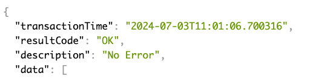

3. `ResetBoardController`에 `list()` 메서드 수정
- `List<BoardDto>` -> `Header<List<BoardDto>>`로 수정
```java
public Header<List<BoardDto>> list(
            @PathVariable(value = "category") String category,
            @RequestParam(value = "page", defaultValue = "0") int page,
            @RequestParam(value = "kw", defaultValue = "") String keyword) {

    Category cate = this.categoryService.getCategory(category);
    Page<Board> paging = this.boardService.getList(page, keyword, cate);
    // 추가된 부분
    PagingDto pagingDto = new PagingDto(10, paging.getNumber() + 1, paging.getTotalElements(), 10);

    /*생략*/
    
    // 수정된 부분
    Header<List<BoardDto>> header = Header.OK(result, pagingDto);
    return header;
}
```
#### frontend
4. `BoardList`에 `console.log`로 확인
```js
const resultCode = response.data.resultCode;
console.log(resultCode);            // Ok or Error

const paging = response.data.pagingDto;  // 페이징 정보
console.log(paging);

for (let i = startPage; i <= endPage; i++) {
    tempPages.push(i);  // [1,2,3,4...]
}
setPageList(tempPages);
```

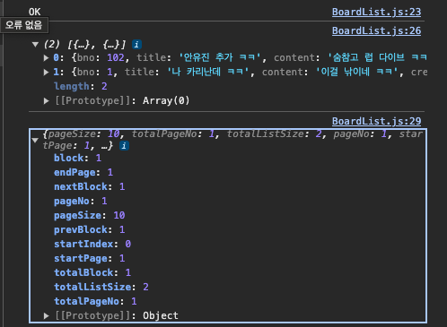

5. `BoardList` 리턴문 페이징 부분 추가
```javascript
            {/*페이징 처리*/}
<div className="d-flex justify-content-center">
    <nav aria-label="Page navigation">
        <ul className="pagination">
            <li className="page-item">
                <a href="#" className="page-link">⏪️</a> {/* <<버튼 */}
            </li>
            {pageList.map((page, index) => (
                <li className="page-item" key={index}>
                    <a href="#" className="page-link">{page}</a>
                </li>
            ))}
            <li className="page-item">
                <a href="#" className="page-link">⏩️</a>{/* >>버튼 */}
            </li>
        </ul>
    </nav>
</div>
```

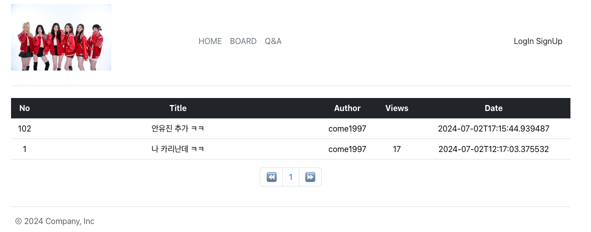

6. `BoardList` 이전,다음 페이지로 넘어가기
```javascript
const [nextBlock, setNextBlock] = useState(0);  // 다음 블럭으로 가기위한 값
const [prevBlock, setPrevBlock] = useState(0);  // 이전 블럭으로 가기위한 값

const {endPage, nextBlock, pageNo, prevBlock, startPage, totalListSize, totalPageNo} = paging;
const tempPages = [];

for (let i = startPage; i <= endPage; i++) {
    tempPages.push(i);  // [1,2,3,4...]
}
setPageList(tempPages);
setNextBlock(nextBlock);    // 다음으로 넘어가기
setPrevBlock(prevBlock);    // 이전으로 다시가기

return (
<li className="page-item">
    <button className="page-link" aria-label="Previous" onClick={() => onPageClick(prevBlock)}>
        <span>⏪️</span>
    </button>
</li>

<li className="page-item">
    <button className="page-link" aria-label="Next" onClick={() => onPageClick(nextBlock)}>
        <span>⏩️</span>
    </button>
</li>
);
```
#### 페이지 1,2번을 눌러도 넘어가고 ⏪️, ⏩️ 를 눌러도 넘어간다!!
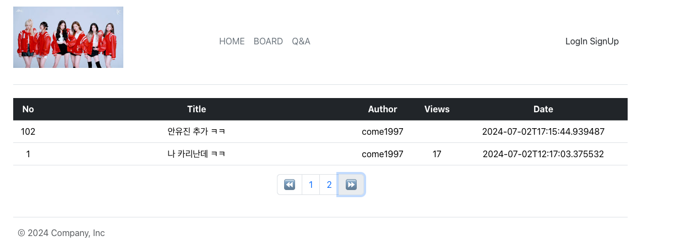

7. `BoardList`에 첫 페이지 마지막 페이지로 넘어가기
```js
const [lastPage, setLastPage] = useState(0);    // 마지막 블럭 번호

const {endPage, nextBlock, pageNo, prevBlock, startPage, totalListSize, totalPageNo} = paging;
const tempPages = [];

for (let i = startPage; i <= endPage; i++) {
    tempPages.push(i);  // [1,2,3,4...]
}
setLastPage(endPage);   // 마지막 페이지로 가기
return (
<li className="page-item">
    <button className="page-link" aria-label="Previous" onClick={() => onPageClick(1)}>
        <span>⏮️</span>
    </button>
</li>
<li className="page-item">
    <button className="page-link" aria-label="Next" onClick={() => onPageClick(lastPage)}>
        <span>⏭️</span>
    </button>
</li>  
);
```

8. 작성일을 수정함수 `formatDate()`로 수정하기
- `common/CommonFunc.js` 생성
```js
// Json은 DateTime으로 넘어오지 못한다.   >>  2024-07-02T12:17:03.375532
export function formatDate(date) {
    var result = date.replace("T", " "); // T를 공백으로 변경
    var index = result.lastIndexOf(" ");    // 공백 뒤 제거

    result = result.substr(0, index);

    return result;
}
```
- `BoardList`의 `createDate` 수정
```js
<tbody>
    {/*반복으로 들어갈 부분*/}
    {boardList.map((board) => (
        <tr className='text-center' key={board.bno}>
            <td>{board.bno}</td>
            <td className="text-center">{board.title}</td>
            <td>{board.writer}</td>
            <td>{board.hit}</td>
            {/*board.createDate => common.formateDate로 변경*/}
            <td>{common.formatDate(board.createDate)}</td>  
        </tr>
    ))}
</tbody>
```

#### Date부분 json data 수정
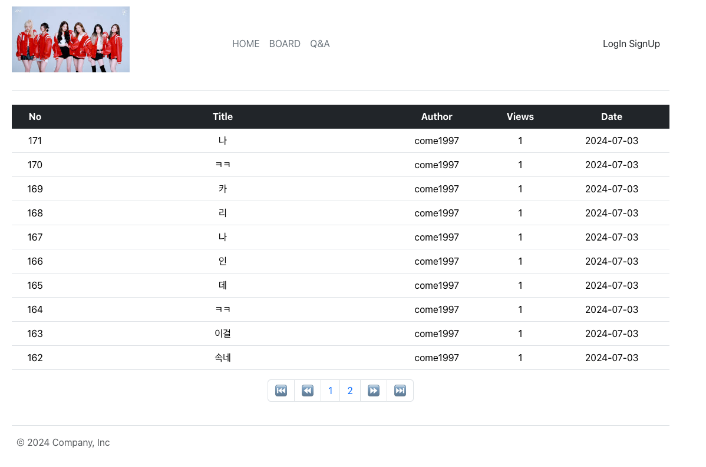

9. `BoardList` 댓글 갯수 표시하기
10. 게시글 번호 순서대로 표시하기
- `RestApiController`에서 로직 수정
```java
@GetMapping("/list/{category}")
@ResponseBody
public Header<List<BoardDto>> list(
        @PathVariable(value = "category") String category,
        @RequestParam(value = "page", defaultValue = "0") int page,
        @RequestParam(value = "kw", defaultValue = "") String keyword) {

    Category cate = this.categoryService.getCategory(category);
    Page<Board> paging = this.boardService.getList(page, keyword, cate);

    PagingDto pagingDto = new PagingDto(10, paging.getTotalPages(), paging.getTotalElements(), 10);
    // 추가된 부분
    AtomicLong currentNum = new AtomicLong(paging.getTotalElements() - (paging.getNumber() * 10));
/*생략*/
    // BoardDto 리턴
BoardDto boardDto = BoardDto.builder()
        .bno(currentNum.getAndDecrement())  // 현재 번호를 사용하고 감소시킴
        .title(board.getTitle())
        .content(board.getContent())
        .createDate(board.getCreateDate())
        .modifyDate(board.getModifyDate())
        .writer(board.getWriter().getUsername())
        .hit(board.getHit())
        .replyDtoList(replies)  // replies 리턴
        .build();
return boardDto;
```

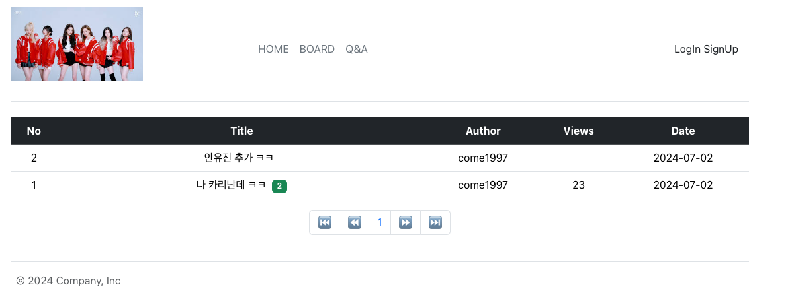

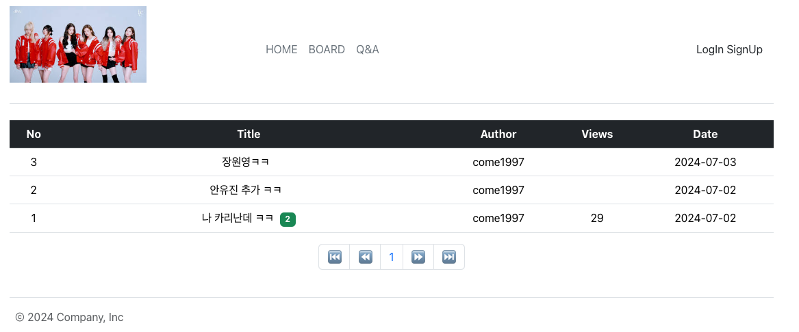

> #### No가 순서대로 들어온다!!


### **3. 상세화면**
1. 특정 카테고리의 게시물 목록을 페이징 처리하여 가져오는 기능 추가
- 페이징과 검색 키워드를 지원하며, 요청 시 페이지 번호와 키워드를 함께 전달한다.
- `RestApiController`에 `detail()` 메서드 추가
```java
@GetMapping("/detail/{bno}")
@ResponseBody
public BoardDto detail(@PathVariable("bno") Long bno, HttpServletRequest request) {

    String prevUrl = request.getHeader("referer");  // 이전페이지 변수에 담기
    log.info(String.format("▶▶▶▶▶ 현재 이전 페이지 : %s", prevUrl));
    Board board = this.boardService.hitBoard(bno);  // 조회수를 증가하고 리턴시킴

    // replies 객체 선언
    List<ReplyDto> replies = board.getReplyList().stream().map(reply -> ReplyDto.builder()
            .rno(reply.getRno())
            .content(reply.getContent())
            .writer(reply.getWriter().getUsername())  // 댓글 작성자 정보 수정
            .createDate(reply.getCreateDate())
            .modifyDate(reply.getModifyDate())
            .build()).collect(Collectors.toList());

    // BoardDto 리턴
    BoardDto boardDto = BoardDto.builder()
            .bno(board.getBno())
            .title(board.getTitle())
            .content(board.getContent())
            .createDate(board.getCreateDate())
            .modifyDate(board.getModifyDate())
            .writer(board.getWriter().getUsername())
            .hit(board.getHit())
            .replyDtoList(replies)  // replies 리턴
            .build();

    return boardDto;
}
```
> `List<ReplyDto> ....collect(Collectors.toList())`: 각 댓글을 `ReplyDto`로 변환하고, 결과 리스트에 추가한다.
>
> `BoardDto boardDto = BoardDto.builder()..`: 게시물 정보를 `BoardDto`로 변환하고, 댓글 리스트를 포함시킨다.
>
> `return boardDto`: 게시물 정보와 댓글 리스트를 포함한 `BoardDto` 객체를 반환한다.

#### 댓글이 있는 게시글
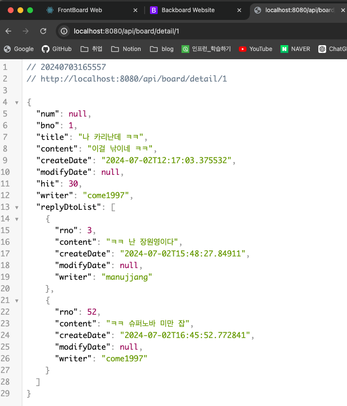

#### 댓글이 없는 게시글
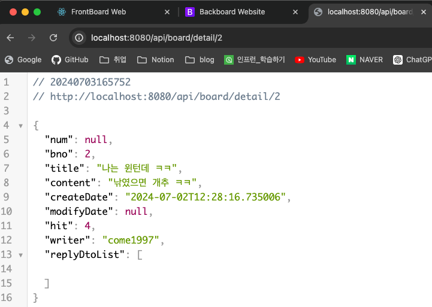

2. `BoardList` 게시글 리스트에 링크 달아주기및 `BoardDetail`가 `bno` 정보를 가져오는지 확인하기

#### `BoardList`
```js
<td className="text-center">
<Link to={`/boardDetail/${board.bno}`}>{board.title}</Link> &nbsp;
{board.replyDtoList && board.replyDtoList.length > 0 && (
    <span className="badge text-bg-success">{board.replyDtoList.length}
    </span>
)}
</td>
```
#### `BoardDetail`
```js
import {useParams} from "react-router-dom";
import {useState} from "react";

function BoardDetail() {
    const { bno } = useParams(); // useParams를 통해 bno 파라미터를 가져옴
    console.log(bno); // bno 값 출력

    // 여기서 bno를 이용해 데이터를 가져오는 로직을 추가할 수 있음

    return (
        <div className="container">
            <h1>{bno}번글에 들어온걸 환영ㅋㅋ</h1>
        </div>
    );
}

export default BoardDetail;
```

#### `App.js`에도 라우트 해준다!!!
```js
import BoardDetail from './routes/BoardDetail';

<Route path="/boardDetail/:bno" element={< BoardDetail />} />
```
#### 링크 추가
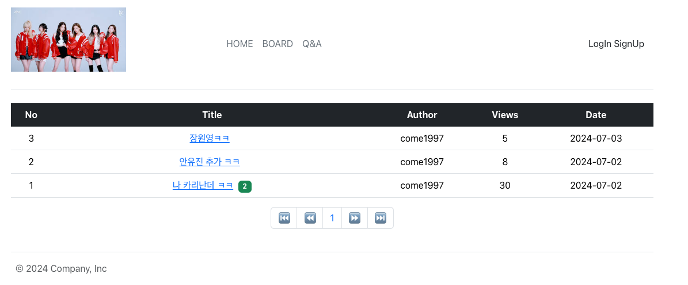

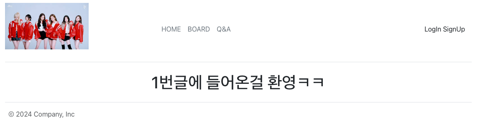

> `/boardDetail/1`번에 `bno` 1번이 잘들어온다


