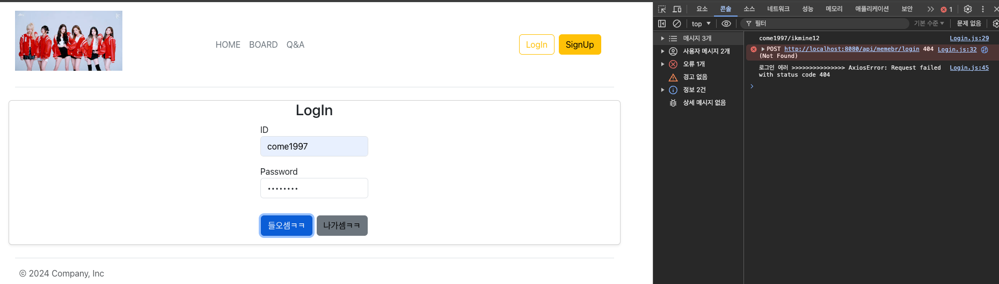
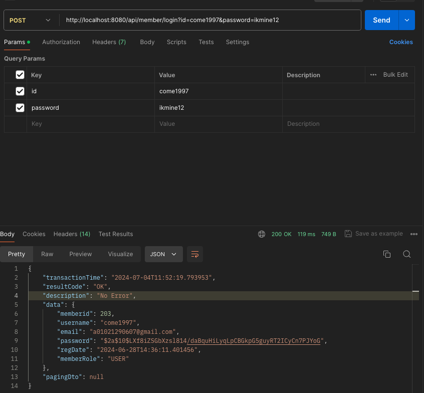
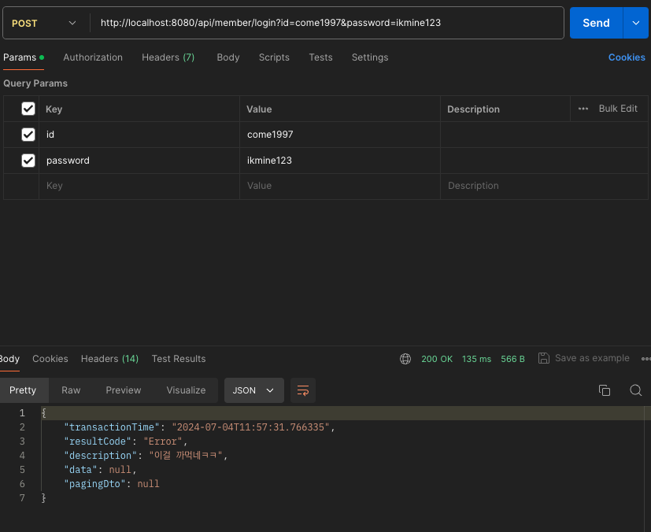
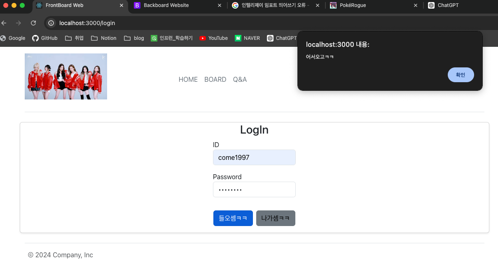
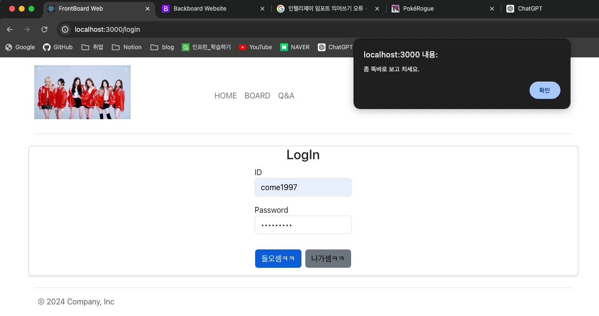

## 17일차

### 목차
1. 로그인
2. 상세화면
3. 입력화면


#### Spring Boot React 연동 프로젝트 개발 


### **1. 로그인**
1. `Header.js`에 로그인 링크를 넣는다.
```js
const Header = () => {
    const navigate = useNavigate(); // Hook 함수는 직접 사용 불가함

    function gotoLogin() {
        navigate("/login");
    }

    /*생략*/
    <button type="button" className="btn btn-outline-warning me-2" onClick={gotoLogin}>LogIn</button>
}
```

2. `Login.js` 로그인 로직을 추가한다.
#### 변수 및 함수 선언
```js
function Login() {
    // 상태 변수 선언
    const [user, setUser] = useState({
        id: "",
        password: "",
    });

    // 함수 선언
    // 입력 필드의 변화가 있을 때 호출
    const handleChange = (e) => {
        const {name, value} = e.target; // id 또는 password 중 하나
        setUser({...user, [name]: value});

        // 폼이 제출될 때 호출
        const handleSubmit = async (e) => {
            e.preventDefault(); // 폼 제출 방지
        }
    
```
#### ID 비밀번호 추가, 백엔드 호출하기
```js
try {
    // 객체를 생성하고, 사용자 ID와 비밀번호를 추가
    const formData = new FormData();
    formData.append("id", user.id);
    formData.append("password", user.password);

    console.log(formData.get('id') + "/" + formData.get('password'));

    // axios 백엔드 호출하기
    const response = await axios({
        url: "http://localhost:8080/api/memebr/login",
        method: "post", // get, post, delete, put...
        data: formData,
        widthCredentials: true,
    })

    if (response.status === 200) {  // 로그인 성공
        alert("하이 ㅋㅋ")
    }


} catch (error) {
    console.log("로그인 에러 >>>>>>>>>>>>>>> " + error);
    alert("좀 똑바로 보고 치세요.")
}
```
#### 로그인이 되면 넘어가는 페이지를 안만들었기 때문에 404오류는 당연한거다!


3. `RestMemberController` 생성 `login()` `post` 메서드를 작성한다.
- `HTTP POST` 요청을 처리하며, `/login` 경로에 매핑하면서 로그인 성공과 실패 로직을 짠다.
```java
@RestController
@RequiredArgsConstructor
@RequestMapping("/api/member") // 기본 경로 설정
@Log4j2
public class RestMemberController {

    private final MemberService memberService;

    @PostMapping("/login")
    public Header<Member> login(@RequestParam Map<String, String> loginInfo) {

        String id = loginInfo.get("id");
        String password = loginInfo.get("password");

        try {
            Member member = this.memberService.getMemberByIdAndPassword(id, password);

            if (member != null) {
                Header<Member> result = Header.OK(member);
                return result;
            } else {
                Header<Member> fail = Header.OK("이걸 까먹네ㅋㅋ");
                return fail;
            }
        } catch (Exception e) {
            log.catching(e);

            Header<Member> fail = Header.OK("이걸 까먹네ㅋㅋ");
            return fail;
        }
    }
}
```
4. `MemberService`에 `getMemberByIdAndPassword()` 메서드를 작성한다.
- 아이디와 비밀번호를 사용하여 데이터베이스에서 사용자를 조회하고, 비밀번호를 검증하는 기능을 수행 메서드를 작성한다.
```java
// 리액트에서 넘어온 정보
public Member getMemberByIdAndPassword(String id, String password) {
    // 사용자 조회
    Optional<Member> _member = this.memberRepository.findByUsername(id);

    Member realMember;
    if (_member.isPresent()) {
        realMember = _member.get();  // 실제 이름의 사용자정보가 넘어온다 => 암호화된 비밀번호까지
        // plain text와 암호화된 값이 같은 값을 가지고 있는지 확인
        boolean match = passwordEncoder.matches(password, realMember.getPassword());

        if (match)
            return realMember;
        else
            throw new NotFoundException("이걸 까먹네ㅋㅋ");

    } else {
        throw new NotFoundException("이걸 까먹네ㅋㅋ");
    }
}
```
5. `PostMan`에서 테스트!
#### DB에 맴버가 있을때


#### DB에 맴버가 없을때



5. `Login.js`에 로그인 성공 or 실패 로직 추가
- `axios`를 통해 서버로부터 받은 응답 `alert`처리
  - 로그인성공: 어서오고ㅋㅋ
  - 로그인 실패: 좀 똑바로 보고 치세요.
```js
    // 폼이 제출될 때 호출
const handleSubmit = async (e) => {
    e.preventDefault(); // 폼 제출 방지

    try {
        // 객체를 생성하고, 사용자 ID와 비밀번호를 추가
        const formData = new FormData();
        formData.append("id", user.id);
        formData.append("password", user.password);

        console.log(formData.get('id') + "/" + formData.get('password'));

        // axios 백엔드 호출하기
        const response = await axios({
            url: "http://localhost:8080/api/member/login",
            method: "post", // get, post, delete, put...
            data: formData,
            widthCredentials: true,
        });
        console.log(response);

        // 추가된 부분
        if (response.data.resultCode == "OK") {
            alert("어서오고ㅋㅋ");
        } else {
            alert("좀 똑바로 보고 치세요.")
        }

    } catch (error) {
        console.log("로그인 에러 >>>>>>>>>>>>>>> " + error);
        alert("좀 똑바로 보고 치세요.")
    }

}
```
#### 로그인 성공!!


#### 로그인 실패!!



